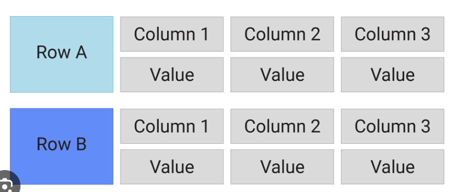

# When/Where to use SQL and NoSQL 

## SQL
- Structure
  - Has table, rows, column
  - Predetermined schema of tables before we start using it
  - Has relations between different tables

- Nature
  - Data is concentrated/centralised in single server.
  - Its not possible to divide similar data across different servers

- Scalability
  - Verticle scaling is intuitive and easier to do. We can increase the RAM size
  - Horizontal scaling is not well supported.

- Property
  - ACID - Atomicity, Consistency, Isolation, Duability
  - ACID makes sure of Data integrity and consistency

## NoSQL
- Works on non structured data,
- Structure
  - Key-value DB (Dynamo DB)
    - We can Query only on the Key, Value is opaque and can be anything string/integer/json
  - Document DB
    - We can Query on the Key as well as Value
    - Value can be json/xml
  - Column wise DB
    - Correcponding to each key we can store a List of Column-Value pairs
    - List corresponding to each key can have different number of column-value pairs
    
  - Graph DB
    - Used in sSocial Networking, Recommendation engines

- Nature
  - It is decentralised/distributed in nature

- Scalability
  - Horizontal scaling is intuitive. We can put key value pai$$r in any server nodes. 

- Propoerty
  - BASE - BA(Basically Available), S(Safe State), E(Eventual Consistency)
    - Data is Available as there exists multiple copies across different servers
    - the nodes can update themselves if some of them receive latest data
    - We can get stale data upon requesting for a key. But eventually upon multiple requests we will get the right data as the nodes update themselves
  - It is a highly available DB
  
|SQL|NoSQL|
|---|---|
|Flexible Query functionality|Basic Query search|
|Data is relational in nature. THere exisis a hierarchy||
|Data consistency is mandatory(ACID). Example - Financial Institutions||
||High availability, high performance in search, query. And we can afford some inconsistency|