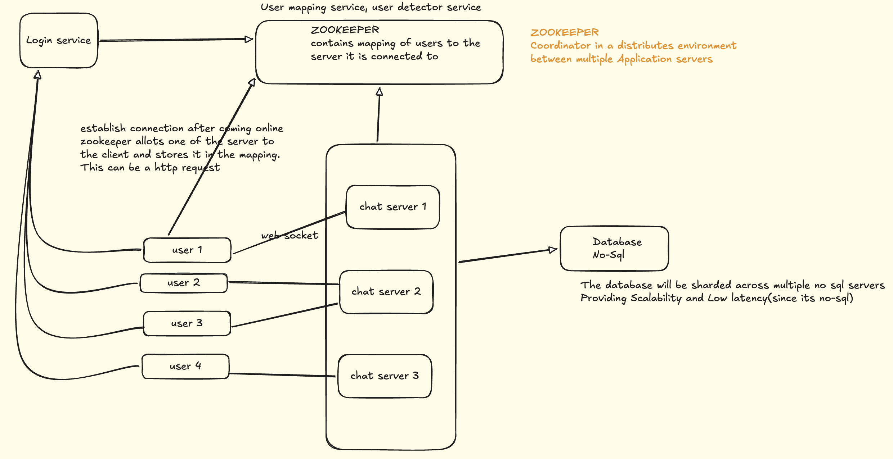

# Design Whatsapp

## Examples
Whatsapp, Messenger, Slack, Discord, Telegram
## Functional Requirements
1. one to one send and receive message (Considering Text for now)
2. Make a group of people and send message to them
3. Last seen/online
4. User login/authentication

## Non-functional Requirement
1. Scalability - should be able to take huge traffic,
2. Low latency 
3. Availability

## Back of the Envelope
NOTE: In iterviews this is not asked so you can skip this part. Can say when interviewer asks
- Total users - 2 B
- Daily active users(DAU) - 50 M
- 1 user -> 10 message -> 4 people in 1 day
- total message = 40 * 50 M  = 200 M message per day = 2 B mesage/day
- Assume 1 message = 100 bytes
- total meemory = 2B * 100 bytes = 200 GB per day
- If we want to maintain chat history for 10 years = MEmory Needed = 10 * 365 * 200 GB = 800TB

## Design
### Part 1
There should be a chat server to which users are connecter to and send message through. How would the users be connected to this chat server ? How will they send message. Options:
1. HTTP connection - user1 can send a request to server to send a messgae to user2. But http requests work in a client->server model not a server->client model, So how will user2 receive the message sent. User2 can do a polling on server to see if it has received any message. Options to do polling:
   - Polling - User2 continuously establishes a connection with server to see if messgae received. If not it closes the connection. 
   - Long Polling - User2 creates a connection with server and waits for 1 minute or some default time. If no messga received in those thime it closes the connection and then creates the connection again. 
 Both the above method leads to wastage of resource and money because in HTTP client sends request, server responds and then the connection breaks.  
2. Web sockets
   - Web socket is a persistent network i.e. the connection is maintained and not broken. 
   - It is bi-directional. Both client and server can send request to each other. 
   - We maintain a single connection between client(user) and the chat server. That single connection is used to send message from client to server and vice-versa

> NETWORK USED: Web Sockets

