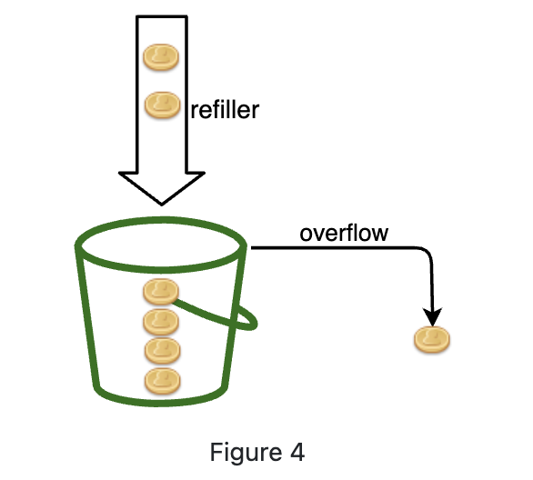
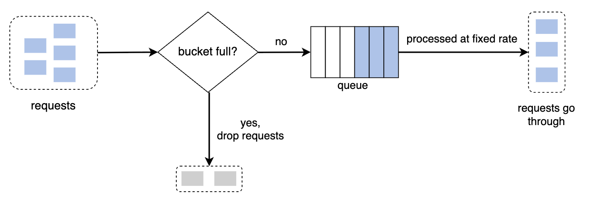
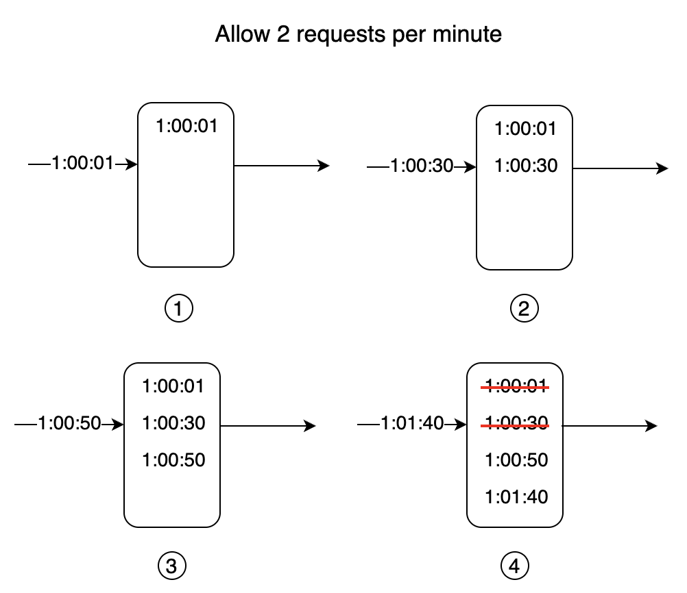
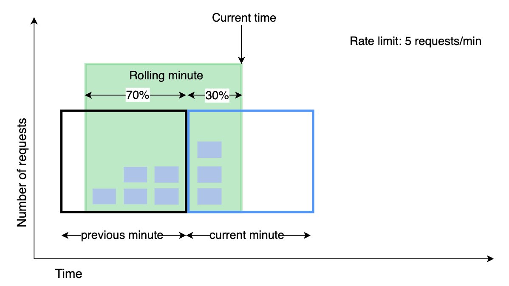
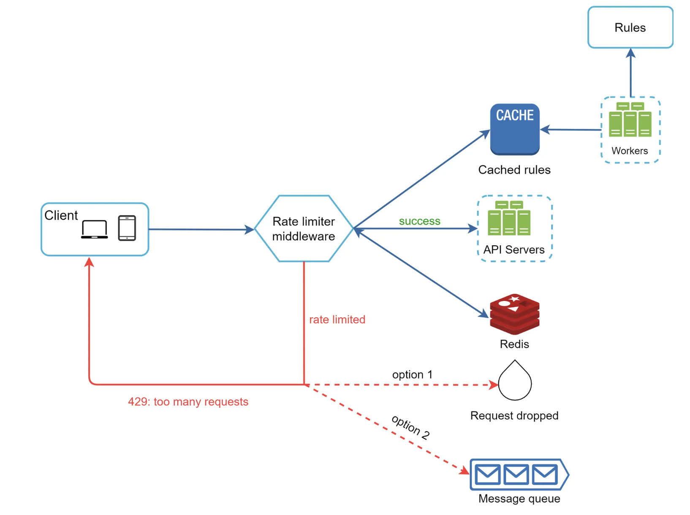

# Design Rate Limiter
### Refs
1. https://bytebytego.com/courses/system-design-interview/design-a-rate-limiter

## Functional Requirements
1. System should be able to identiy client using Client ID, Ip address and API key to identiy the routing needed
2. The system should be able to limit the HTTP requests based on the respective API rules. 
3. If limit is reached it should return HTTP 429 error to the client

## Non Functional requirements
1. The Rate limiter should be able to handle large number of requests ~ 1M rps
2. It shouldnt add more latency to the requests. Keep it minimum to <10ms per request clicks
3. Availability > Consistency for prioritising user experience and we can achieve eventual consistency. And also avoiding malacious clients which might try to attack servers

## Data Entities
1. Client
2. Rules
3. Request

## System Interface
1. Input
   1. Request should have client id, ip address, api key etc to identiy request
   2. API rules to apply on the incoming requests
2. Output
   1. If limit is reaches, should return HTTP 429 error else pass the request to the server
   2. Should allow the limited client in the given duration of window
   3. Should return the `retry-after` to the client in case it gets blocked
   4. In some cases we can return `X-RateLimit-Remaining` and `X-RateLimit-Reset` as well. 
   
## Algorithms
1. Token Bucket
2. Leaking bucket
3. Fixed Window Counter
4. Sliding Window Log
5. Sliding Window Counter

### 1. Token Bucket
- We define config of capacity how many tokens can be stored in a bucket. 
- Refiller keeps adding token after certain time to the bucket.
- If the bucket is full and we add more tokens, it gets overflowed and removed.
- We can configure this for each user - Example - Each user can send 3 token per POST api in 1 minute

1. Each request consumes one token. When a request arrives, we check if there are enough tokens in the bucket.

2. If there are enough tokens, we take one token out for each request, and the request goes through.

3. If there are not enough tokens, the request is dropped

> * **NOTE:** Two parameters in the algorithm are bucket size and token refill rate. However, it might be challenging to tune them properly.
> * This handles both sustained load (the refill rate) and temporary bursts (the bucket capacity). A user might use all the tokens in the start of the time and we need to decide perfect burst limit our system can handle.

### 2. Leaking Bucket
The leaking bucket algorithm is similar to the token bucket except that requests are processed at a fixed rate. It is usually implemented with a first-in-first-out (FIFO) queue. The algorithm works as follows:

- When a request arrives, the system checks if the queue is full. If it is not full, the request is added to the queue.

- Otherwise, the request is dropped.

- Requests are pulled from the queue and processed at regular intervals.

Leaking bucket algorithm takes the following two parameters:
- Bucket size: it is equal to the queue size. The queue holds the requests to be processed at a fixed rate.

- Outflow rate: it defines how many requests can be processed at a fixed rate, usually in seconds.

> Shopify, an ecommerce company, uses leaky buckets for rate-limiting [7].

Pros:
- Memory efficient given the limited queue size.

- Requests are processed at a fixed rate therefore it is suitable for use cases that a stable outflow rate is needed.

Cons:
- A burst of traffic fills up the queue with old requests, and if they are not processed in time, recent requests will be rate limited.
- There are two parameters in the algorithm. It might not be easy to tune them properly.

### 3. Fixed Window Counter
Fixed window counter algorithm works as follows:
- The algorithm divides the timeline into fix-sized time windows and assign a counter for each window.

- Each request increments the counter by one.

- Once the counter reaches the pre-defined threshold, new requests are dropped until a new time window starts.

> A major problem with this algorithm is that a burst of traffic at the edges of time windows could cause more requests than allowed quota to go through. 

### 4. Sliding Window Log(Timestamp)
It works as follows:
- The algorithm keeps track of request timestamps. Timestamp data is usually kept in cache, such as sorted sets of Redis [8].

- When a new request comes in, remove all the outdated timestamps. Outdated timestamps are defined as those older than the start of the current time window.

- Add timestamp of the new request to the log.

- If the log size is the same or lower than the allowed count, a request is accepted. Otherwise, it is rejected.

> PROS: Rate limiting implemented by this algorithm is very accurate. In any rolling window, requests will not exceed the rate limit.
> CONS: The algorithm consumes a lot of memory because even if a request is rejected, its timestamp might still be stored in memory.

### 5. Sliding Window Counter
- Fixed window counter + sliding window log

Assume the rate limiter allows a maximum of 7 requests per minute, and there are 5 requests in the previous minute and 3 in the current minute. For a new request that arrives at a 30% position in the current minute, the number of requests in the rolling window is calculated using the following formula:
- Requests in current window + requests in the previous window * overlap percentage of the rolling window and previous window

- Using this formula, we get 3 + 5 * 0.7% = 6.5 request. Depending on the use case, the number can either be rounded up or down. In our example, it is rounded down to 6.
- 

## Design
- We can use **Redis** to maintain the counter or queue for various different algorithims 
- Config files are stored in disk but we can store its copy in cache so we dont have to load from disk every time

- Rate limiter works as follows at the high-level:
  - Read the counter value from Redis.
  - Check if (counter + 1) exceeds the threshold.
  - If not, increment the counter value by 1 in Redis.

#### Single server Rate Limiter design
- Single Server Rate Limiter Design:

#### Multiple server Rate Limiter design
- Two issues we can see:
  - Race condition - two different clients getting same counter value from redis. Solution - Redis.
  - Synchronization - same client going to two different servers and the other server might not have context of the client. Solution - Having counters in Redis and not in the App server.
- We can have multiple Rate Limiter servers(distributed). In case client requests goes to different Rate Limiter servers(multiple rate limiters might exist over multiple API Gateways). We can have Redis to maintain the Counter and queue. 
- Redis inherently does not suport atomicity but we have solutions to ensure Atomicity in redis
  - We can use Locks to ensure atomicity. DOWNSIDE is it adds to the Latency
  - Other popular options: Lua script and sorted sets data structure in Redis. Lua script ensures we read the current state, calcuylate the new token count and update the bucket in one atomic step
  - **Why Redis ?** - It is fast, highly available and provides atomic operation 