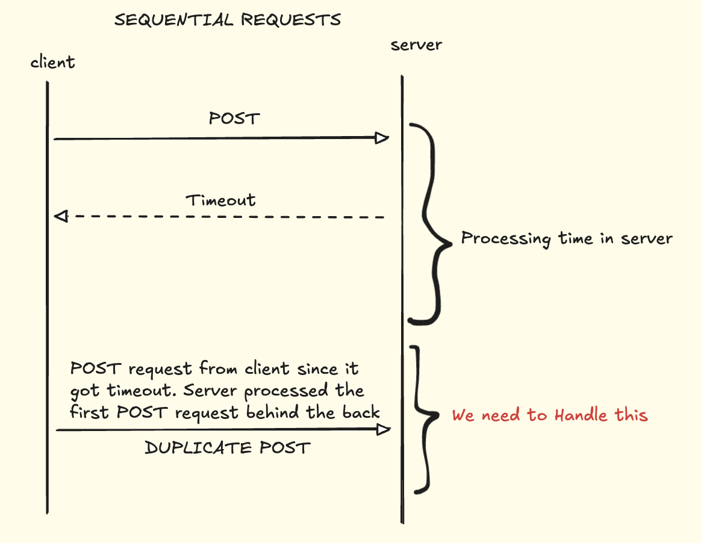
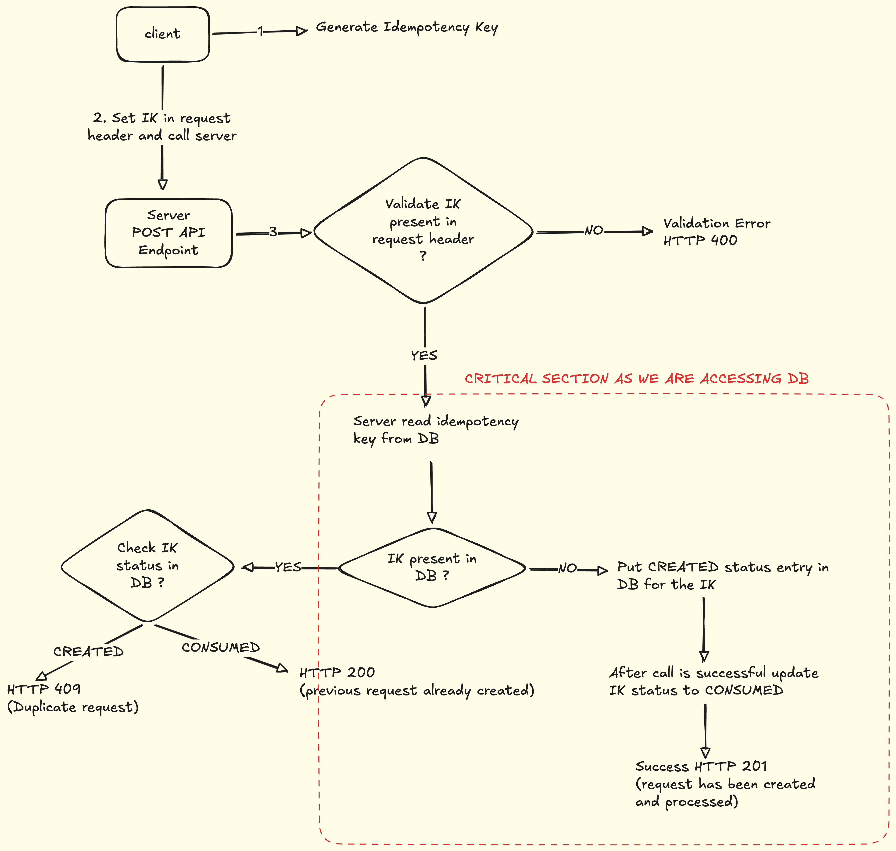

# Design Idempotency in POST API

- Idempotemcy enables clinet to safely retry an operation without worrying about the side effect the operation can cause.
- By default GET, PUT, DELETE are idempotent in nature
- POST is not idempotent. Two issues can happen:
  1. SEQUENTIAL REQUEST
    
  2. PARALLEL REQUESTS
    

### Approach for Idempotency Handling
- Client should generate Idempotency Key and pass it to the server in the request header
- Idempotency keys are Unique Ids for each different request
- Below Flow solves the Sequential request Issue.
- We will face problem for Parallel Requests as they can access the Critical section mentioned together and create duplicate entries in DB
  - To solve this race condition we use Mutex/Semaphore in the Critical Section to apply Locks 

### Follow ups
- What is client request goes to different servers. those different servers might have different Databases
- Different databases can be synchronised to copy data among themselves. But this is a heavy operation and will add the the latency
- To resolve this We can have cache between the server and Databse. Synchronisation between caches are fast 