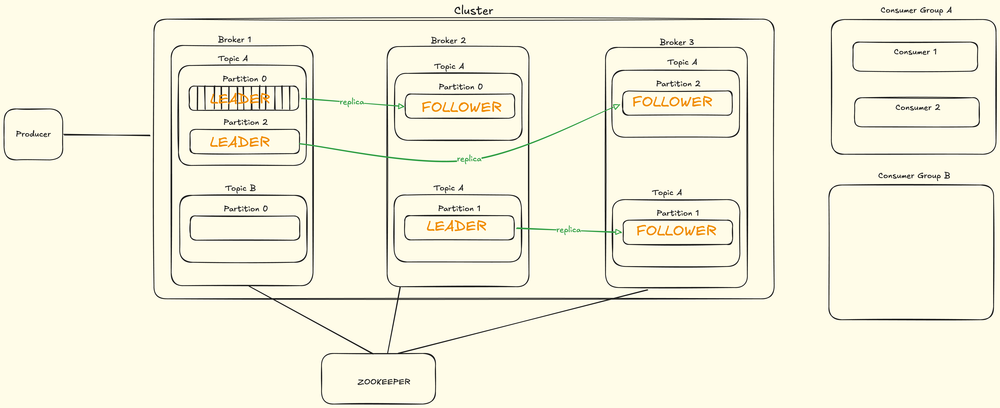
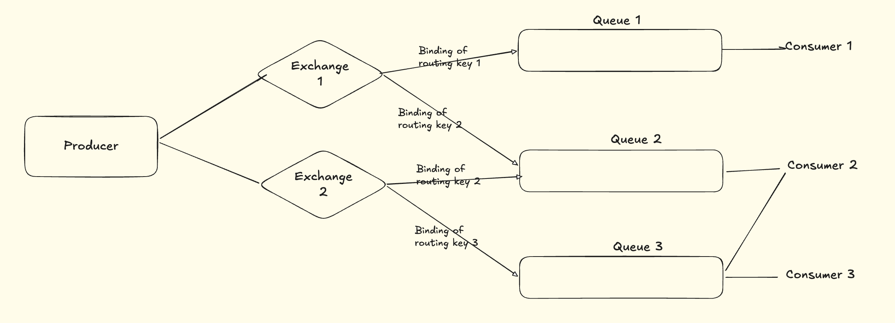

# Distributed Messaging Queue 

### Questions
1. What is messaging Queue and why is it needed ?
2. What is Point2Point and Pub/Sub messaging type ?
3. How Messaging Queue Works ?
   1. Kafka
   2. RabbitMQ
4. WHat happend when Queue size limit is reached ?
   - We add multiple different brokers
5. What happend to messages, when Queue goes down ?
6. What happens when consumer goes down ?
7. WHat happens when consumer not able to process message ?
8. How Retry works? Different ways to retry ?
9.  How distributed messagin queue works ?
10. WHat is dead letter queue

### Kafka
COMPONENTS:
1. Producer
2. Consumer
3. Consumer Group
4. Topic
5. Partition
6. Offset
7. Broker
8. Cluster
9. Zookeeper

- Kafka is Pull based . Consumers need to Pull from Brokers if it has received any message.
- Different Consumers in a single consumer group cant process message form the same partition same topic
- Different Consumer from different consumer groups can process message from the same partition same topic
- Producer sends below to the queue
  - Key (Optional) - Hash is calculated from key and relevant partition is assigned. If not present message is added to the Partition passed
  - Value (Needed)
  - Partition (Optional) - If not present message is added in round robin method to the next Partition
  - Topic Name - Topic to which value needs to be added
- Zookeeper - Helps coordinate between different Brokers
- Consumer Group may have multiple consumers. They cant read from the same Partition.
  - Consumer1 after reading from Partiton0 maintains a **committed offset** which tells till which offset message has been read
  - **Committed Offset** data is stored in Zookeeper
  - In case Consumer1 goes down, then the other Consumer2 starts reading from the **committed offset** of the Partition0 
- Main Partitons are known as **Leader**. Its replicas are called **Follower**
  - When ever Leader receives a message, the Follower syncs up the message with Leader.
  - If Leader goes down, the Follower takes over. Consumer consumes from Follower
- If Consumer is not able to consume a message, it will try N retry from its previous offset
  - If It still fails to process the message, the message is moved to a **Dead Letter Queue**

### RabbitMQ
- Push based
- Fan Out Approach
  - Sends the message to every Queue associated with the Exchange
- Direct Approach
  - Key is passed in request and message sent to that particular binding key
- Topic Exchange
  - Wildcard is used. Message is sent to every Topic which matches the Wildcard
- NO concept of Offset. If consumer is not able to process the message, it will requeue the message and make N trials before sending it to the Dead Letter Queue
  