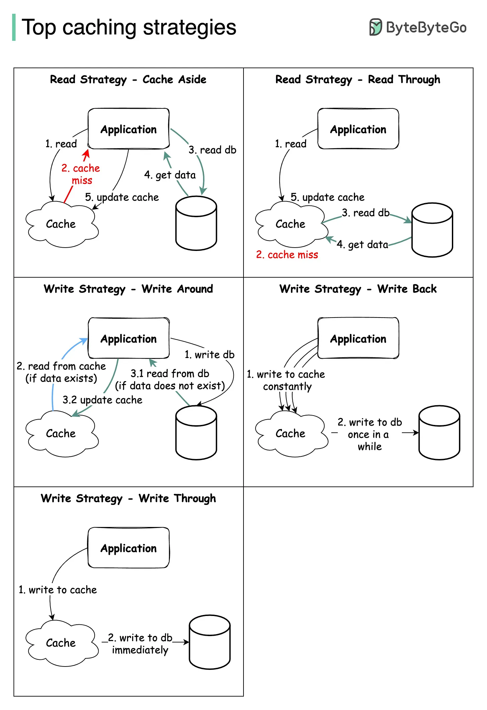

# Caching

- Storing frequently used data in fast access memory instead of slow access memory
- Helps achieve fault tolerance

## Single Cache Server
- Multiple different servers, But all have a common shared cache.
- The cache size can become very big. Scalability is a issue
- Single cache is a SINGLE POINT OF FAILURE

## Distributed Caching
- **Cache Pool** has multiple Cache Server
- Each App Server has its own **Cache Client** which helps the App connect to its Cache server from the Pool
- Cache Server gets allocated to the App server based on **Consistent Hashing** of the incoming request to the App

## Caching Strategy

#### Cache Aside
- Application check Cache
- If cache Hit, return data
- If cache miss -> App fetch from DB -> App store data in cache -> retuen data to client
- Advantage:
  - Good for Heavy read app
  - If cache gors down, it doesnt affect the app
  - Cach data document can be different from the DB Data structure
- Disadvantage:
  - Cache Miss for every new data read
  - Inconsistency in READ operation if proper caching is not done in WRITE operations

#### Read through Cache
- App check cache
- If cache Hit, return data
- Cache Miss -> Cache Library fetch data from DB -> Cache Library store in Cache -> Cache library return data to App
- Advantage:
  - Good for Heavy read app
  - App is separate from the logic of fetching and updating data in Cache
- Disadvantage:
  - Cache Miss for every new data read
  - Inconsistency in READ operation if proper caching is not done in WRITE operations
  - Cache document structure needs to be same as DB

#### Write Around Cache
- Used along with either Cache Aside OR Read through Cache
- Alone this cache strategy is of no use
- Directly WRITE data in DB
- Does not write data in Cache
- **Invalidates old data in Cache. Marks it dirty**
- Advantage:
  - Good for Heavy read app
  - Solves Inconsistency problem between cache and DB
- Disadvantage:
  - Cache Miss for every new data read

#### Write through Cache
- First Write data in Cache
- Then in Synchronous Writes data into DB
- If any one transaction - writing in cache OR writing in DB, fails, we need to return exception
- Advantage:
  - Cache and DB always remain consistent
  - Cache hit chances increase a lot
- Disadvantage:
  - Alone this is not useful. Need to be used along with Cache Aside OR Read through. If we have nothing to read then it will add latency and resource wastage
  - 2 Phase commit need to be supported. 
  - If DB is down, write will fail. (Not fault tolerant)

#### Write Back(or Behond) Cache
- First Write data in Cache
- Then in Asynchronous Writes data into DB
- Cache puts the data into a queue and keeps the data for the set TAT(tuen around time) like 1-2 days.
- Advantage:
  - Good for Write heavy App
  - Improve Write operation Latency
  - Cache hit chances increase a lotGive bettwr performance with used with read through cache
  - Even when DB fail, Write operation works
- Disadvantage:
  - If data is removed from cache, DB write wont happen (SOLVED by keeping TAT(turn around time) of Cache higher like 2 day )

