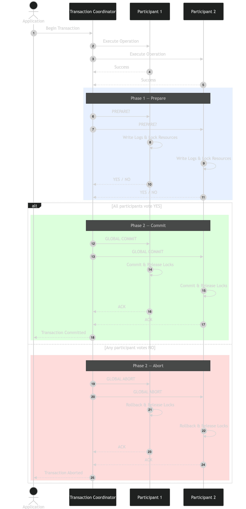
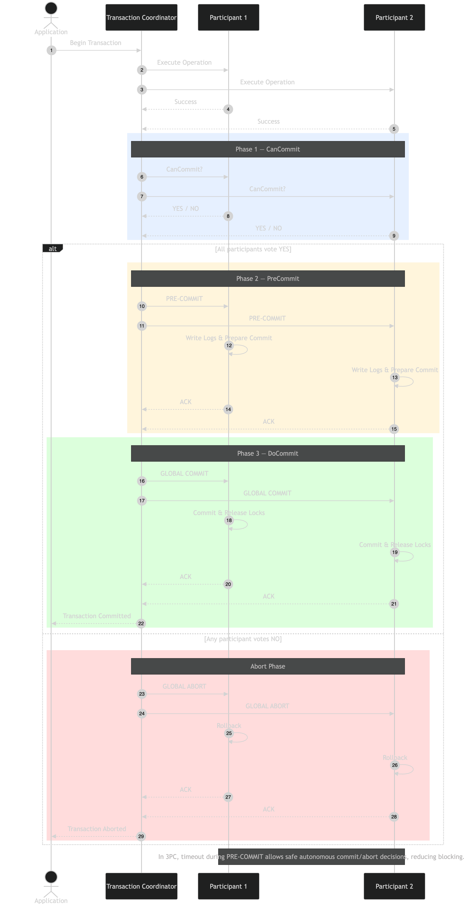

# Distributed Transaction

- Transaction - Set of operations/Group of tasks need to be performed on DB
- Transaction Properties:
  - Atomicity - All operation in transaction should succeed or fail
  - Consistency - DB state before and after ransaction should be consistent
  - Isolation - more than one transaction running concurrently, should be serialised
  - Durability - Data should not get lost, if DB fails after a successful transaction

## Transaction in non-Distributed System
- Transaction happening on single server DB
- We can apply locks for all the 

## Transaction in Distributed System
- Multiple Transactions over multiple Databases 
- As a transaction is local to a particular DB, how to ensure Transaction properties over a distributed system
- ISSUE: If a transaction needs to happen across DB1 and DB2. Since transaction operations are local to a DB, if an operation fails in DB2. It will rollback the changes of DB2 only. But it should rollback DB1 changes as well.

## How to handle Transaction in Distributed System ?
1. 2 Phase Commit
2. 3 Phase Commit
3. SAGA Pattern

### 2 Phase Commit
- Synchronous in nature
- 2 Phases
  1. Prepare Phase
    - The coordinator sends a Prepare request to all participants.
    - Each participant checks if it can complete the transaction and responds with either a Yes (prepared) or No (abort).
    - If any participant responds with a No, the process halts, and the transaction is rolled back.
  2. Commit Phase
    - If all participants respond with Yes, the coordinator sends a Commit command, and all participants commit the transaction.
    - If any participant responds with No, the coordinator sends an Abort command to rollback the transaction across all participants.
- PROS:
  - Ensures strong consistency by maintaining atomicity across distributed transactions.
  - Simpler to implement
- CONS:
  - Transaction Coordinator is a Single Point of Failure: The coordinator contains all the decision logs so in case it goes down the Participants are blocked with the resources untill the coordinator comes back up
  - The participant cannot decide by itself whether to COMMIT or ROLLBACK after voting YES, so it must wait indefinitely for the coordinator’s final decision.
  

### 3 Phase Commit
- Synchronous in nature
- To resolve Blocking issue, Coordinator sends the decision log of commit to the participants in the Pre commit phase
- So in case Coordinator goes down, after the pre commit phase, the participants know that COMMIT decision has been taken and after timeout they can take the decision.
- 3 Phases
  1. Prepare Phase
     - Similar to 2PC, the coordinator sends a Prepare request to participants, asking if they can commit the transaction.
     - Each participant responds with Yes or No.
  2. Pre Commit Phase
     - If all participants respond Yes, the coordinator sends a Pre-Commit message, indicating the transaction is likely to be committed.
     - Participants acknowledge the Pre-Commit, preparing to commit the transaction but not yet completing it.
  3. Commit Phase
     - If all participants acknowledge the Pre-Commit, the coordinator sends the Commit command.
     - If any participant fails to acknowledge the Pre-Commit, the transaction is Aborted.

### SAGA Pattern
- Asynchronous in nature
- 2PC/3PC are atomic in nature - all-or-nothing transactions
- SAGA decomposes transactions into smaller local transactions each managed by separate services
- If a local transaction fails, the saga executes a series of compensating transactions to undo the changes that were made by the preceding local transactions.
- CONS:
  - Sacrifices immediate strong consistency as we may see temporary inconsistent states
  - 

#### Choreography SAGA
- In a choreography-based approach, each local transaction publishes events that trigger local transactions in other services. Therefore, no central coordinator is telling the saga participants what to do.

#### Orchestration SAGA
- In an orchestration-based saga, a central orchestrator (or coordinator) manages the entire transaction. The orchestrator sends commands to each service to perform their local transactions. It also handles any failures by sending commands to execute compensating transactions as necessary.

## Consclusions
- 2PC/3PC is less scalable, tightly coupled and cross-db transactions
- SAGA is more scalable, loosely coupled and local transactoons in db

