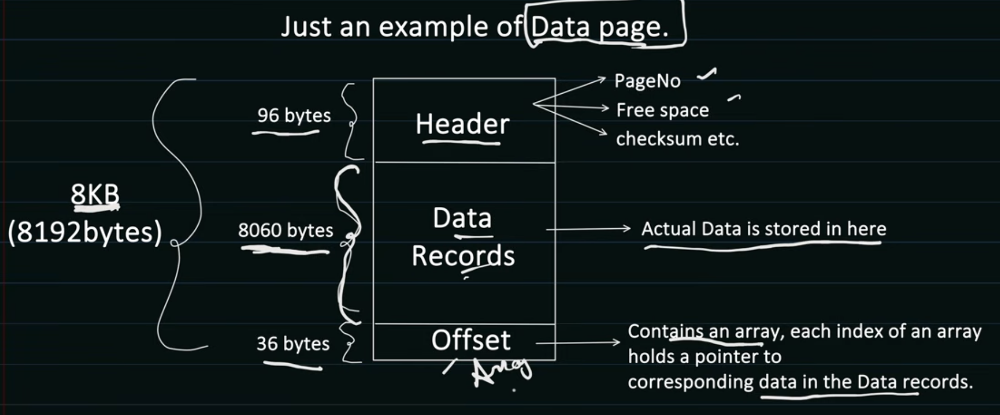
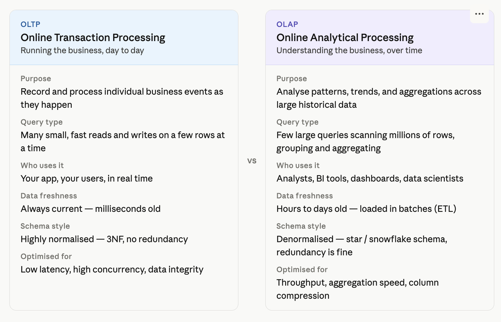

# Database Indexing

> Ref: https://www.youtube.com/watch?v=6ZquiVH8AGU&list=PL6W8uoQQ2c63W58rpNFDwdrBnq5G3EfT7&index=25

## How Table data is stored ?
- DBMS creates **Data Pages** (generally 8KB)
- Each Data Page can store multiple table rows in it.

- To store all the data of one table, DBMS can create many Data Pages
- Data Pages gets stored in **Data Block** in Physical Memory
```
DATA BLOCK
- Minimum amount of data which can be read/write by IO Operation
- Managed by underlying storage system
```
- Each Data Block can contain mamny Data Pages
- Data Page can get stored in any Data block as it is managed by the storage and not DBMS, SO DBMS maintains **mapping of Data Page and Data Block**
  
## Indexing
- Used to increase performance of Database Query. So, data can be fetched faster
- Without Indexing, DBMS would be iterating over all the table rows to find the data
- O(N) time complexity. For million of rows it too much

### Data structure used
- B+ Trees provide O(Log N) time complexity for **insertion, searching and deletion**

## Types of indexing
### Clustered Index
- The actual table data itself is stored in sorted order according to the indexed column.
- So the leaf nodes of the B+ Tree ARE the actual data pages.
- PROS:
  - Range queries are fast - rows sit contiguously on disk
- CONS:
  - Only one clustered index per table we can have
  - Page splits on insert — inserting a row in the middle forces the engine to split a page, causing fragmentation and write amplification.
  - Random inserts (e.g. UUID primary keys) cause severe fragmentation. Sequential keys (INT, BIGINT IDENTITY) are much friendlier.

### Non Clustered Index
- The table rows remain elsewhere.
-  The index stores: indexed_key -> pointer_to_row
-  Since data rows are stored in a separate heap, this extra step from the index to the heap is called a **key lookup**
-  PROS:
   -  We can create multiple indexes per table 
   -  No page splits in the heap on insert — rows append in insertion order; only the index tree is reorganized.
-  CONS:
   -  Extra hop (key lookup / bookmark lookup) — after finding the RID in the index
   -  More storage — the index is a separate B+Tree structure; covering indexes that include many columns consume significant space.
  
## NOTE
- Primary and secondary key is design time concept
- Clusteres and non-clusterd index is storage time concept
- Primary Key in tables use Clustered index by default
  - Primary keys are almost always used in point lookups and joins, and a clustered index makes both of those as cheap as physically possible.
> A primary key and a clustered index are not the same thing. The PK is a constraint that enforces uniqueness. The clustered index is a storage decision that controls physical row order. By default most databases wire them together — but you can have a clustered index on a non-PK column, and you can have a PK that is backed by a non-clustered index.
- Secondary Keys use Non clustered index by default
  - Multiple secondary (non-clustered) indexes slow things down, but only on the write side. Reads get faster.
  - Every time a row is inserted, updated, or deleted, the database must update every non-clustered index that covers an affected column — each one is a separate B+Tree that needs its own write.

## OLAP vs OLTP



- **OLTP uses row-oriented storage.** All columns of a row sit together on the same page. When you fetch WHERE UserID = 42, you read one page and get all columns of that user. This is perfect for fetching complete records quickly — which is what transactional apps do constantly.
- **OLAP uses column-oriented storage.** All values of a single column (say, Revenue) are stored together, separate from other columns. When an analyst runs SUM(Revenue) GROUP BY Region, the engine reads only the Revenue and Region columns — skipping CustomerName, Address, Phone, and every other column entirely. On a table with 50 columns and 500 million rows, this means reading 2/50ths of the data instead of all of it. Combined with compression (similar values in a column compress dramatically), this is why OLAP systems are orders of magnitude faster for aggregations.

> Modern systems like Snowflake, BigQuery, and Redshift are pure OLAP. PostgreSQL, MySQL, and SQL Server are primarily OLTP, though SQL Server and PostgreSQL have columnstore index support that lets them handle some OLAP workloads without a separate system.