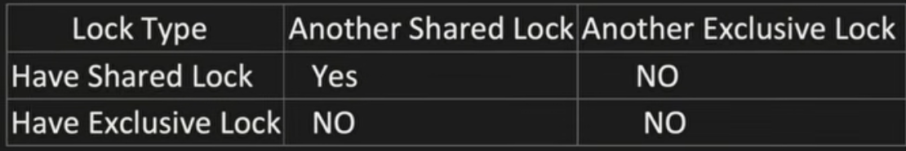
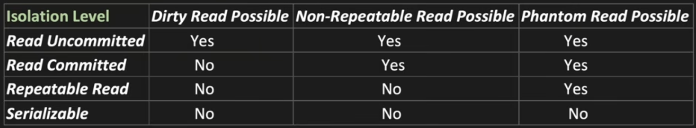
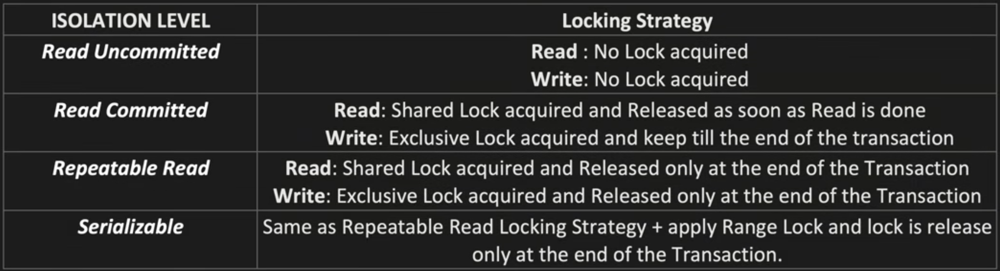

# Concurrency Control

- What is Transaction ?
  - Helps to achievev Integrity and avoid Inconsistency in DB.

- What is DB Locking ?
  - Helps to ensure no other Transaction update the locked rows
  

- Isolation Levels ?
  - Dirty Read — Reading uncommitted data from another transaction. If that transaction rolls back, you read data that never officially existed.
  - Non-Repeatable Read — You read the same row twice in a transaction and get different values because another transaction modified and committed it in between.
  - Phantom Read — You run the same query twice and get different rows because another transaction inserted/deleted rows matching your filter in between.
  
  

## Distributed Concurrency Control
1. Optimistic concurrency control
   - Uses Isolation Level of below Repeatable Read
   - Much Higher Concurrency 
   - No Deadlock
   - In case of conflict, overhead of transaction rollback and retry logic
   - Uses Versioning to resolve conflicts
    ```
    T1 and T2 both want to update Account A (balance: 1000, version: 1)
    1. T1 → reads balance = 1000, version = 1  (no lock)
    2. T2 → reads balance = 1000, version = 1  (no lock)
    3. T1 → deducts 200
    T1 → checks: is version still 1? YES → write 800, version = 2, COMMIT ✅
    4. T2 → deducts 500
    T2 → checks: is version still 1? NO (it's 2) → ❌ ROLLBACK, RETRY
    5. T2 retries → reads balance = 800, version = 2 → deducts 500
    T2 → checks: is version still 2? YES → write 300, version = 3, COMMIT ✅
    ```


2. Pessimistic Concurrency control
   - Uses Repeatable Read or Serialisatble Isolation Levels
   - Less concurrency compared to Optimistic
   - Deadlock issue. Transaction stuck in deadlock need to forced rollback
   - Puts a long lock. Sometime timeout issue can come
   ```
   T1 wants to update Account A (balance: 1000)
   1. T1 → LOCK row for Account A
   2. T1 → reads balance = 1000
   3. T2 → tries to read Account A... ⏳ BLOCKED (waiting for lock)
   4. T1 → deducts 200, writes balance = 800
   5. T1 → COMMIT, lock released
   6. T2 → now gets the lock, reads balance = 800 ✅
   ```
> Pessimistic blocks T2 from even starting. Optimistic lets T2 proceed but rejects it at the end if data changed.