# OAuth

> refs: https://www.youtube.com/watch?v=3Gx3e3eLKrg&list=PL6W8uoQQ2c63W58rpNFDwdrBnq5G3EfT7&index=28
- OAuth is a way to let an app access your data without sharing your password.

- Main components in OAuth
  - Resource Owner - User
  - Client App - Spotify
  - Authorization Server - Google login server
  - Resource Server - Google api (gmail, drive etc.)

- Authorization Grant Types
  1. Authorization Code Grant (IMP)
  2. Implicit Grant 
  3. Resource Owner Password Credential Grant
  4. Client Credential Grant
  5. Refresh Token Grant (IMP)

### Authorization Code Grant
- The user authenticates directly with the Authorization Server, and only a short-lived "code" is sent back through the browser. The actual tokens are exchanged server-to-server, keeping them out of the browser entirely

