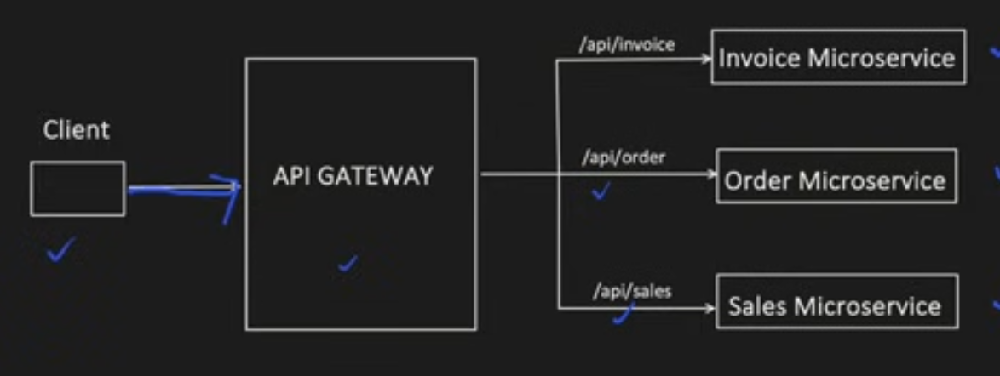
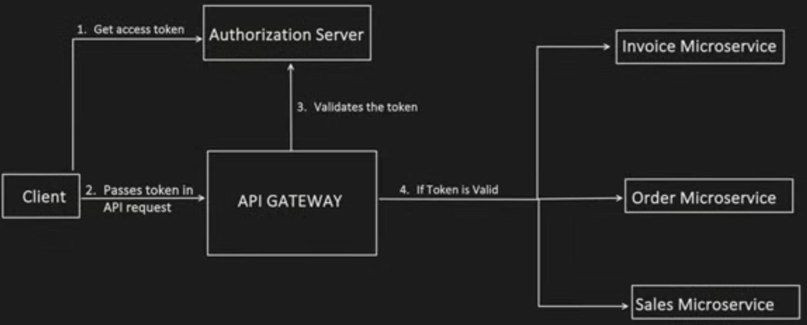
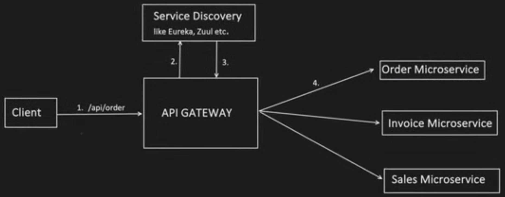
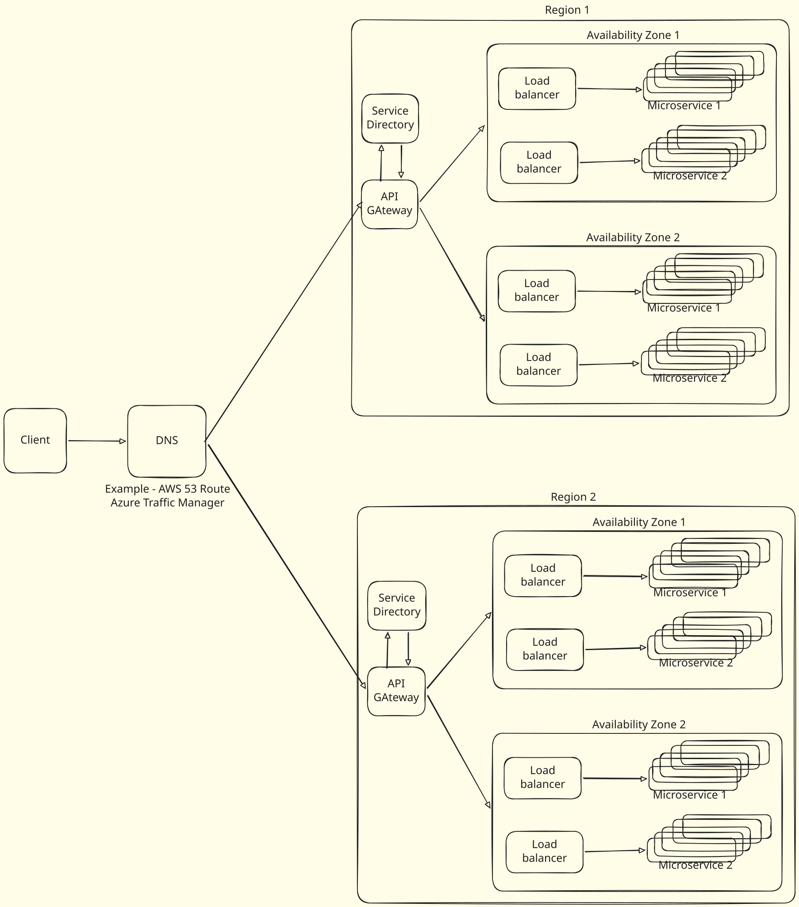

# API Gateway

- API Gateway accepts the client API Requests and route them to correct backend service based on API Endpoint
  

- How Load Balancer is different?
  - It distributes the traffic to multiple instance of the same microservice base on factors like health, traffic load etc.
  - Load Balancer doesnt have the capacility to understand the API and then take decision, where to route it
  
## Uses of API Gateway
1. API Composition
   - Same application would want to show different details when accessed from different types of device like mobile, pc, tablet
   - API Gaeway has the capability to read the device of incoming requests and call the relevant apis
   - Example - Netflix uses this
2. Authentication
   -  Authenticate OAuth2.0 flow
   

3. Rate Limiting
   - Manage Burst Limit - We can limit the max number of concurrent requests that API Gateway can handle before returning 429 error (too many requests)
   - API Throttling - limit the number of requests from a particular user after he crosses the allowed request rate
   - IP based blocking
   - API Queues - Hold request to an api which cannot be processed immediately. Solves Thundering herd problem
4. Service Directory
   - A microservice can scale up and scale down. Service directory keeps track of their location (IP address, port)
   - Approach 1 : Each microservice register and deregister themselves
   - Approach 2: Service directory keeps health check of microservices and keep on ly the active ones.
    
5. Request-Response transformation
6. Response caching
7. Logging

### Microservice Archtechture
> NOTE: DNS is not a single point of failure below

