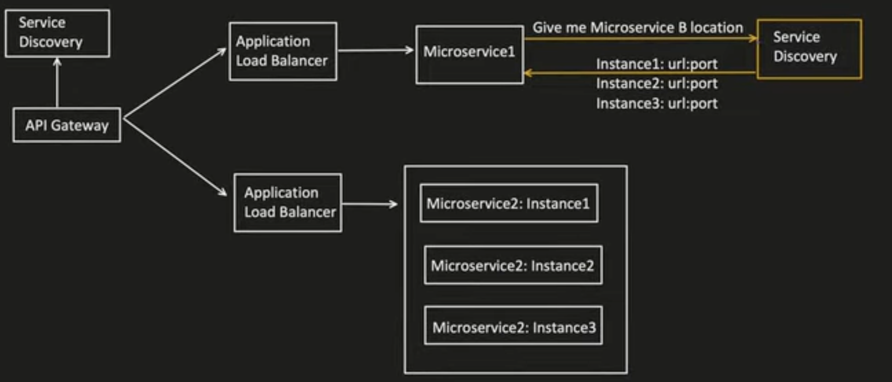
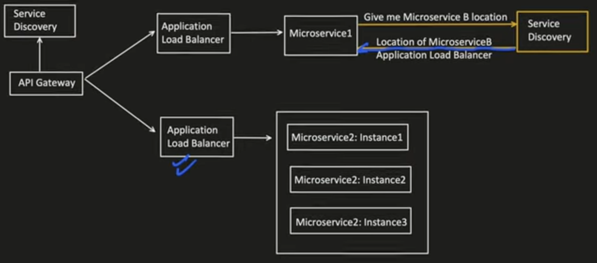
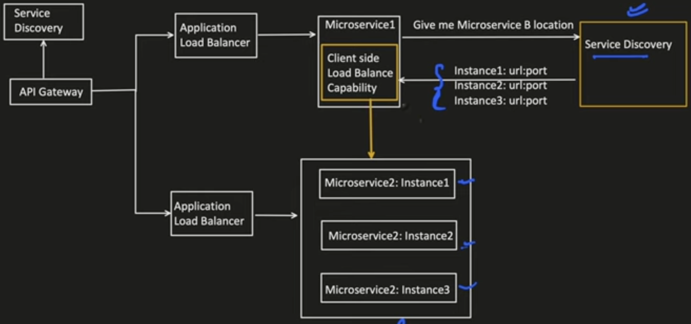
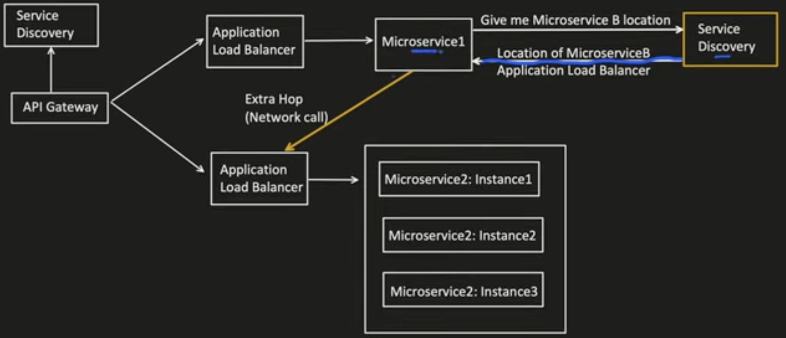
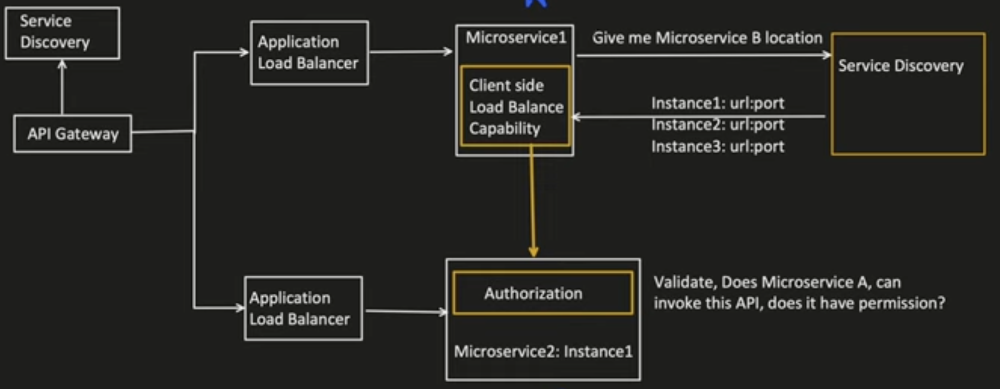
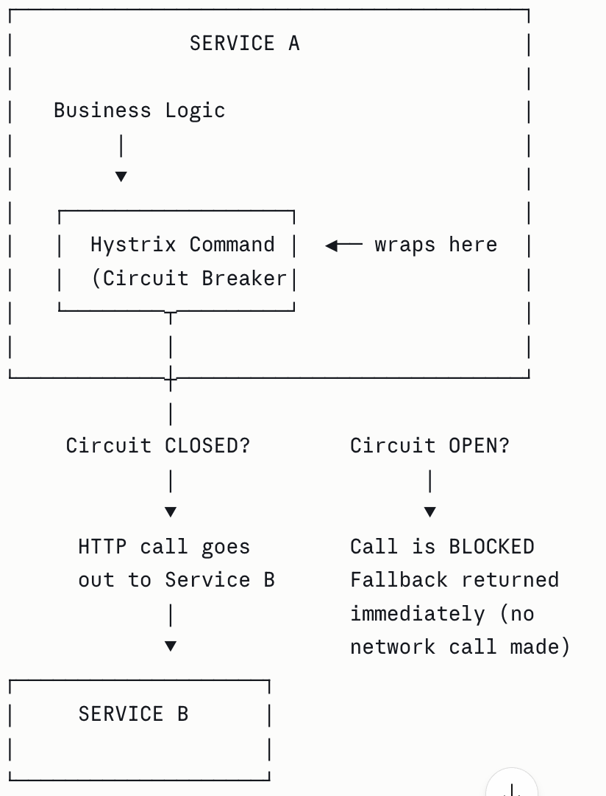
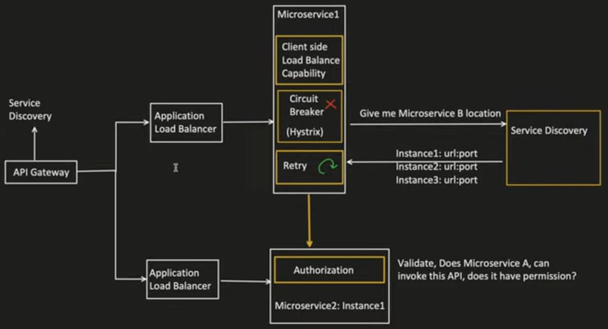
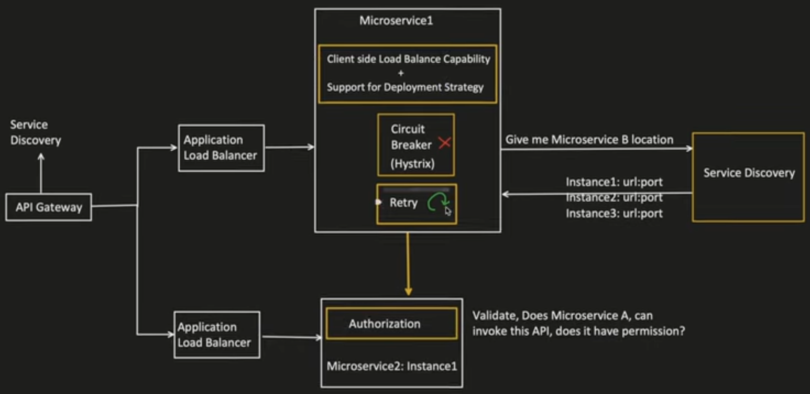
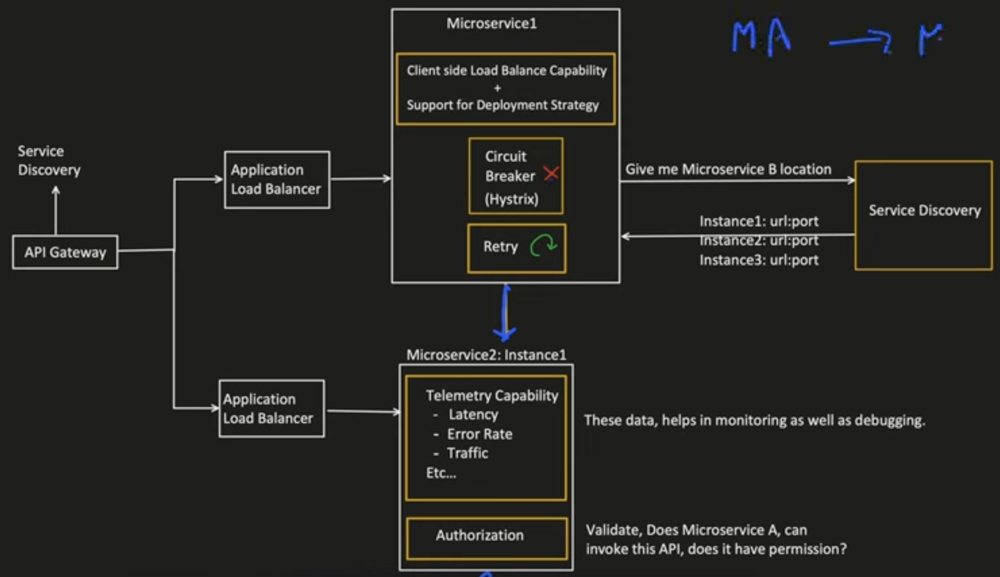
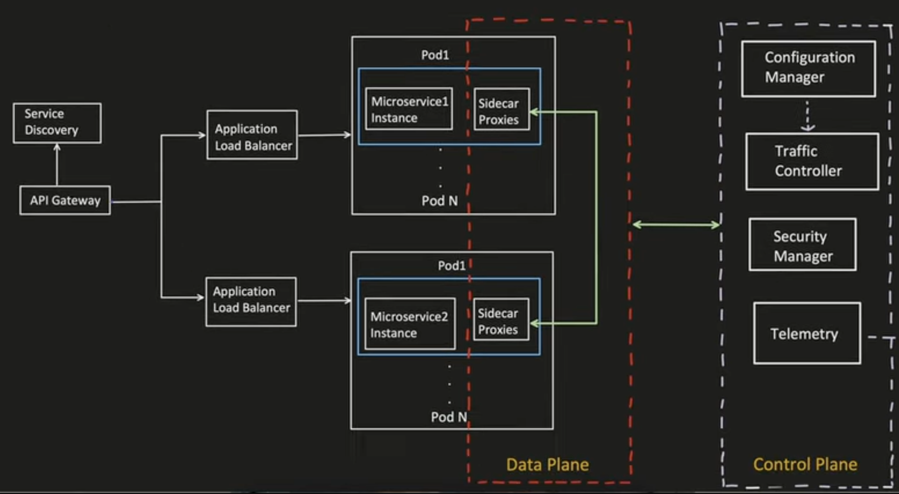

# Service Mesh

## How two microservice communicate with each other ? What are the capabilities required ?

1. **Service Discovery Capability**
   - MS1 needs to communicate with MS2, then it needs it location (host and port)
   - Scenario 1: Service discovery returns all the MS2 instances
   
   - Scenario 2: Service discovery returns the location to Load Balancer of MS2
   

2. **Load Balancing Capability**
   - Scenario 1: MS1 need to have Load balancing capability
   
   - Scenario 2: MS1 will need to do an extra hop to call MS2 Loadbalancer
   

3. **Authorization**
   - MS2 should be able to Authorize as well as Authenticate the requests coming from MS1
   

4. **Circuit Breaker Capability**
   - In case calls from MS1 to MS2 fails continuously. If the failed requests goes above a threshold we break teh circuit from MS1 to MS2.
   - Hystric in Springboot provide this capability
   

5. **Re-try Capability**
    

6. **Deployment Strategy**
   - Deployment Strategies - Canary, Red-Black, Blue-Green
   - Generally load balancer helps to control this.
   - In Scenario 1, sclient side load balancer will also have to implement this.
   

7. **Telemetry Capability**
   - Colled data which helps in the monitoring of service/components
   - MS2 need to implement telemetry capability for all the requests it receives
   

> In above image we need 6 components for MS1 and MS2 to communicate with each other. We will need to implement all of those

## Service Mesh
   - Sidecar Proxy is added in the service pod
   - Sidecar Proxy has the capability to intercept all the requests which go out of and received in a microservice
   - All Sidecar proxy can directly talk to each other
   - Sidecar proxy has the capability of load balancing, service discovery, authentication, deployment strategy, circuit breaker, retry, telelmetry etc.
   - The config for all of them can be controlled from Configuration Manager
   -  Security manager helps in the communication and encryption of data being exchanged between sidecar proxy of different pods
   - The communication between Control plane and data plane doesn not happen in real time. Whenever there is a config change the call is made. So active network calls are not there 

