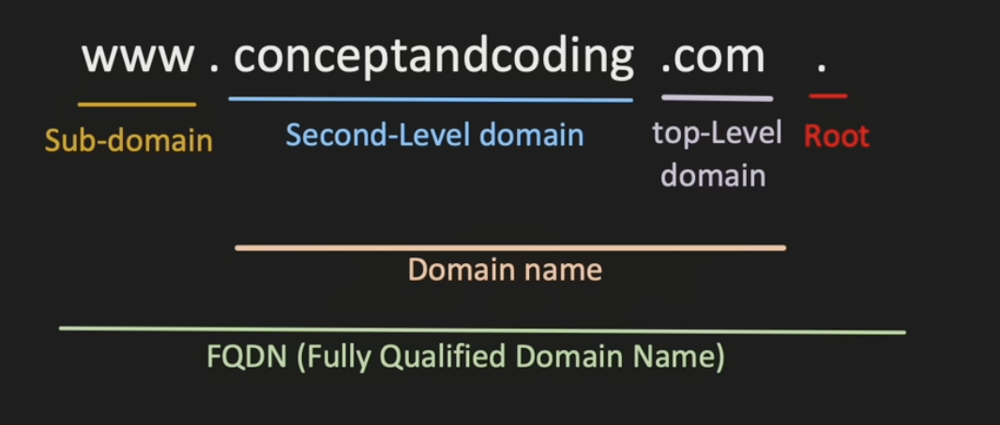
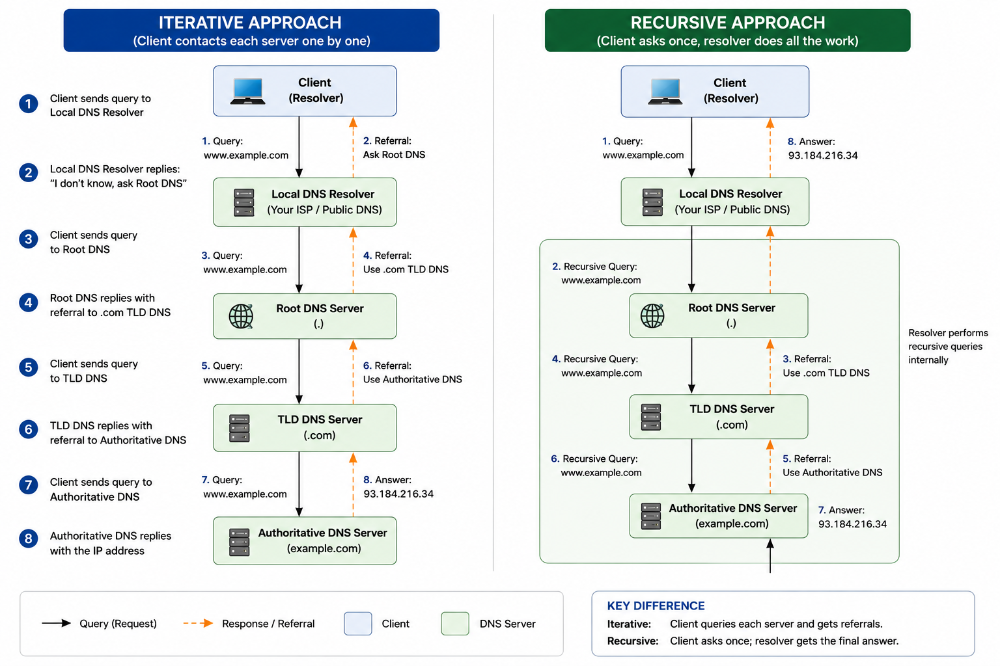

# DNS

- IP Address - Unique numerical label assigned to each server/device connected on internet
- Domain Name - Human readable/friendlt address used to identify server/device on internet
- DNS - Helps to translate domain name to IP addresses

## How domain name is resolved ?
1. Recursive
   - Client calls Local DNS Resolver once. 
   - Local DNS Resolver recursively calls all other dns servers
2. Iterative
   - Client itself is responsible for calling local dns server and then iteratively to all other servers.

