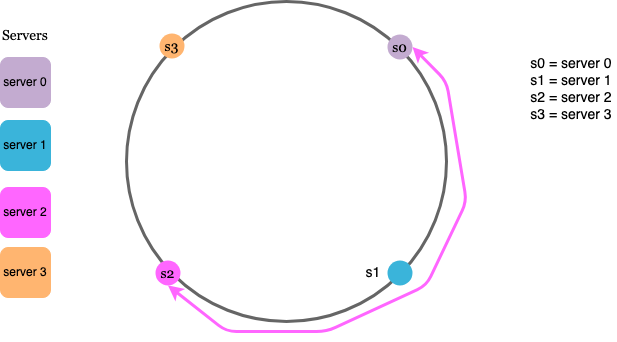
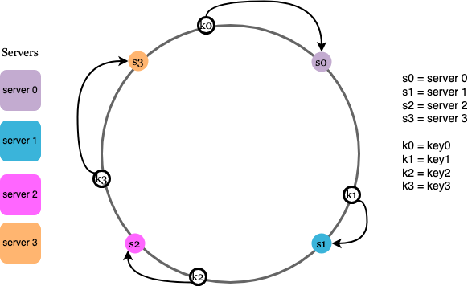
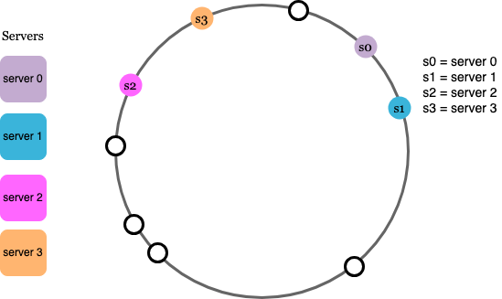
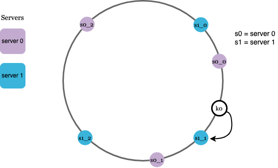

# Consistent Hashing

- A common approach is to use hash the request and assign it to a server using Hash(key) mod N, where N is the number of servers.
- However, this method is highly dependent on the number of servers, and any change in N can lead to significant rehashing, causing a major redistribution of keys (requests).
- Consistent hashing addresses this issue by ensuring that only a small subset of keys need to be reassigned when nodes are added or removed.

- Instead of distributing keys based on Hash(key) mod N, consistent hashing places both servers and keys on a circular hash ring.

## How it works ?
- To find out which server a key is mapped to, go clockwise from the key position until the first server on the ring is found.

#### Issues
The servers can have different range of partition on the virtual circle and can also be skewed that they all are next to each other. In these cases majority of the request data ends up getting allotted to a single server

#### Solution
We use multiple different virtual nodes(indexes) on the virtual circle to represent a single server.
As the number of virtual nodes increases for all the different servers, the distribution of keys become more consistent.

