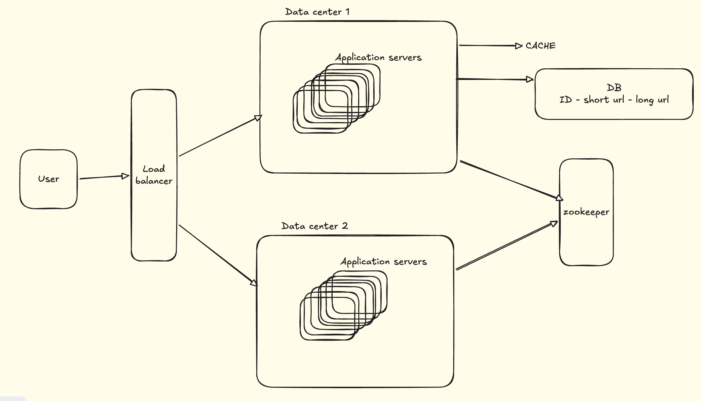

# URL Shortning

## Requirements
- Use alpha numeric characters - [0-9,a-z, A-Z] - 62 characters available
- How short should the URL be ?
  - If we are hitting 10M requests per day => 10 * 365 * 100 M requests for 100 years
  - 365 Billion request OR 365 Billion URLs
  - If URL length is 1 => 62 URLs can be generated
  - 62^6 ~ 56 Billion, 62^7 ~ 3.5 Trillion
  - So minimum 7 length url it should be 

## How to generate Hash ?

### 1. Hash Function 
     1. MD5 - Generates a 128 bits OR 32 hexa digit hash characters
        128 bits - 8 bytes
        4 bits needed to represent 1 hexadecimal(base 16)
        1 Byte = 8 bits = 2 hexa
        So, 128 bits = 16 bytes = 32 hexa digits

     2. SHA-1 - Generate 160 bits OR 40 hexa digit hash character
  As we need only the first 7 characters, we use that. But it can lead to conflict as the initial 7 characters can be same for two inputs

### 2. Base 62
- Any decimal can be converted to base 62 
- But first we need to convert given input into a decimal id
```
Generating unique id in distributed system ?
  1. Have a DB - A single DB will become too large and have multiple DBs can lead to duplicate keys. 
  2. Have a common Ticket server for all the deployed Application server. For each rech rewuest Ticket server receives it auto increments the id and returns. But it has a single point of failure in case the ticket server fails.
  3. Snowflake (good solution) - Based on Timestamp, machine code and sequence number
  4. Zookeeper - Application that coordinated among the application servers. We divide the available range of 3.5 Trillion into multiple smaller range. Allot each smaller range to a separate Application server. All requests from a server gets allocated to the allocated range. In case the range is all filled up we allot a new range to the Application server
 ```
- Length of the generated hexa characters can be different for different ids
    - We can pad the generated hexa characters with '='
- Is it possible that we get length greater than 7. NO because we are generating id for given input in the the range of 3.5 Trillion. If we go beyond that it will generate a 8 length hexa character 

