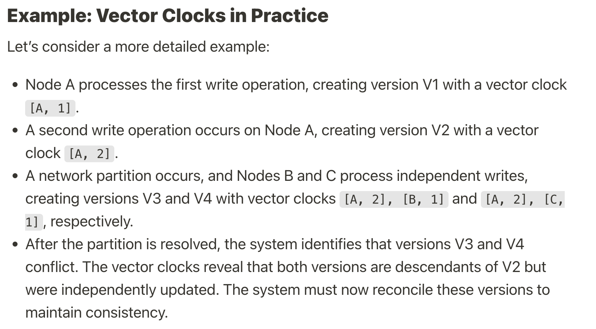

# Key Value Store

## Goals
1. Scalability
2. De-centralization
3. Eventual Consistency

## Steps
1. Partition
2. Replication
3. Get and Put Operation
4. Data Versioning
5. Gossip Protocol
6. Merkle Tree

### 1. Partition
- Partitioning into several servers and use **Consistent Hashing** to allot keys to the next available server
- This ensures **Scalability**

### 2. Replication
- Ensures **De-centralization**
- We replicate the same key value pair in multiple different servers.
- The Main server in which the key is allotted is called **Coordinator**
- And then by default we replicate the same keys to the next N-1 server
- Allocation to next servers need not be sequention
  - Keys are not allocated to Virtual Nodes of the coordinatior
  - We might also want to allot keys to servers which are in different Data Center than the Coordinator one (In case the Coordinator Data Center fails, we can fetch key from another Data center)
- Each keys lies in a certain range (that whole range gets alloted to the next available server). 
- The keys have a **Preference List** of the servers where their replicas are stored. The Coordinator is the first preference.
- Each server knows about its preference list i.e. in which servers to put the replica of the incoming keys.

### 3. Get and Put Operation
##### PUT(key)
- First put the key in its revelant server (Coordinator)
- Coordinator replicated the data in **Async Manner** to the servers present in its preference list(Each Coordinator already has its preference list).
- Replicas are made into N-1 servers
- When we get acknowledgement from Coordinator and W number of success acknowledgement from replica servers we return success response for PUT(key).

> LOAD BALANCER
> - We can have Load balancer before request reaches the Consistent Hashing for Put or Get
> - Two Types:
    1. Generic Load Balancer - 
       - Not aware of the server and range partition so it cna send the put request anywhere. But since every range and server in Consistent Hashing is aware of the Preference List for the range in which the generated key actually lies, the server to which generic LB sent the request, sends the key to its actual Coordinator. 
       - Involves **High Latency** because of request Hopping. 
    2. Partition Aware Load Balancer - 
       -  Aware of the partitions in the Consistent Hashing and allocated the incoming request in its correct range
       -  **Lower Latency**
-  

##### GET(key)
- Request goes to the Coordinator
- Coordinator requests R servers from the Preference list to return the value of the key stored in them
- Only after Coordinator has received R values, it returns the response for GET(key)

### 4. Data Versioning
- Ensures **Eventual Consistency**
- In case some server fails while doing PUT(key) operation. It can lead to data inconsistencies. 
- We resolve this by data versioning which uses vector clock
- A **vector clock** is a [server, version] pair associated with a data item. It can be used to check if one version precedes, succeeds, or in conflict with others.

- Coordinator returns all the inconsistent data found in other servers which were written later.
- Client is responsible for resolving the conflicts along with Coordinator

### 5. Gossip Protocol
- Each server maintains a list of all the other servers
- In periodic intervals servers sends below two things to random servers
  - Heartbeat to tell its up
  - Its range 
- If the heartbeat for a particular server hasnt been updated across multiple other servers for more than a particular period of tiime, the initial server is said to be down

### 6. Merkle Tree
- A hash tree or Merkle tree is a tree in which every non-leaf node is labeled with the hash of the labels or values (in case of leaves) of its child nodes. Hash trees allow efficient and secure verification of the contents of large data structures
- Helps us to identify whether all the keys within a range of a particular Coordinator/Server . Does replica also has the same updated version of the latest data. If not, what is the range of keys which is not updated. 