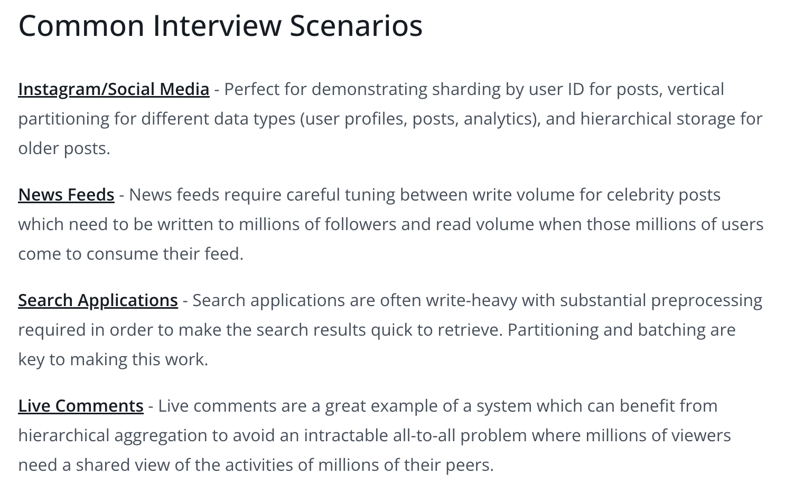

# Scaling Writes

## 1. Vertical Scaling and Write Optimization
* First we try to optimise write using the existing hardware only
### 1.1 Vertical Scaling
* We have powerful hardwares - can scale CPU cores and the Network bandwidth for the DB

### 1.2 Database Choices
* **Cassandra** 
  * Write heavy DB
  * Superior write throughput through its append-only commit log architecture
  * Instead of updating data in place (which requires expensive disk seeks), Cassandra writes everything sequentially to disk
  * Cassandra's read performance isn't great
* **Other Databases:**
  * **Time-series databases:** InfluxDB , TimescaleDB
  * **Log-structured databases:** LevelDB
  * **Column stores:** ClickHouse

## 2. Sharding and Partitioning
### 2.1 Horizontal Sharding
* Important to choose good **Partitioning Key** to shard the data
* Select a key that **minimizes variance in the number of writes per shard**

### 2.2 Vertical Partitioning
* Instead of cramming everything into one massive table, you break it apart based on how the data is actually used.

## 3. Handling Bursts with Queues and Load Shedding
* Autoscaling is not the full proof solution here
  * Scaling up and down takes time
  * With database systems it frequently means downtime or reduced throughput while the scaling is happening
### 3.1 Write Queues for Burst Handling
* Kafka or SQS
* Decouples write acceptance from write processing
* Advantage:
  * **Burst absorption**
    * The queue acts as a buffer, smoothing out traffic spikes
    * Database processes writes at a steady rate 
* Disadvantage:
  * **Unbounded growth of our queue**, if write to DB is consistently slower compared to writing to queue
> Use queues when you expect to have bursts that are short-lived, not to patch a database that can't handle the steady-state load.
### 3.2 Load Shedding Strategies
* When system is overwhelmed, need to decide which writes to accept and which to reject
* If we can drop the less important writes, we can keep the system running and the more important writes will still be processed.

## 4. Batching and Hierarchical Aggregation
* Individual write operations have overhead like network round trips, transaction setup, index updates.
* DBs process batches more efficiently than individual writes.
### 4.1 Batching
* Instead of processing writes one by one, batch multiple writes together to amortize this overhead
* Can be done at: 
  1. **Application layer:** works especially well when the application itself isn't the source of truth for the data, else we need to handle situation when the application crashes
  2. **Intermediate Processing:** Intermediate process which batches up writes before they are sent to the database
  3. **Database Layer**

### 4.2 Hierarchical Aggregation
* Used in most extreme cases
* For high-volume data like analytics and stream processing, you often don't need to store individual events and instead need aggregated views.

## Deep Dive
### 1. "How do you handle resharding when you need to add more shards?"
* Gradual migration targets writes to both locations (e.g. the shard we're migrating from and the shard we're migrating to). 
* This allows us to migrate data gradually while maintaining availability.

### 2. "What happens when you have a hot key that's too popular for even a single shard?"
* **Split All Keys**
  * Split all keys a fixed k number of times. 
  * Each shard will only have a subset of the data
  * Write volume for a given shard is reduced by k times.
  * Downside:
    * Overall size of dataset increase by k
    * Read volume increases by k as well
* **Split Hot Keys Dynamically**
  * Break the hot key into multiple sub-keys dynamically based on whether the key is hot or not.

# Note

