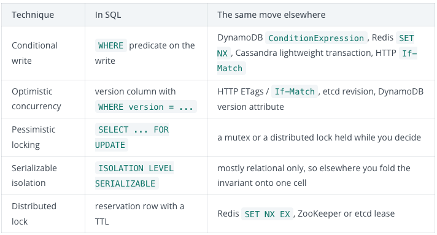
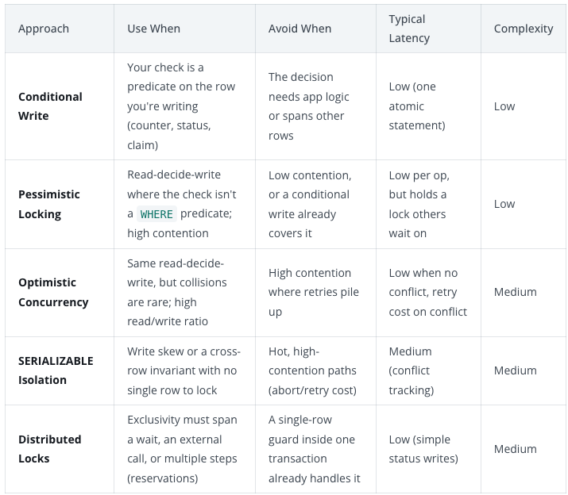
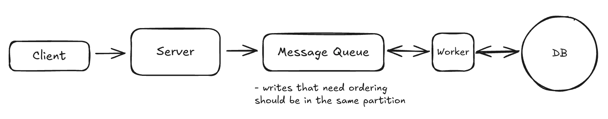

# Dealing with Contention

* The race exists because the read and write aren't atomic. Reading the count and writing the new value back are two separate steps, and in between them the world can change
* This race condition is a **lost update**, the classic failure of a read-modify-write cycle. 
* **Lost Update:** Two requests read the same value, both act on it, and both write back, so one silently overwrites the other.
* Each solution relies on read-modify-write where you make the write conditional on the value not having changed
  
## 1. Conditional Writes
#### Step1
* When your rule is just an **if** about the current data **(eg. only decrement if a seat is left)**, the database can check the condition and apply the change in a single atomic statement - no locks or version numbers needed.
```
UPDATE concerts
SET available_seats = available_seats - 1
WHERE concert_id = 'weeknd_tour'
  AND available_seats > 0;
```
* No matter how many people try to grab the last ticket at once, only one will succeed
*  **The reason is that the database won't let two updates change the same row at the same time. DB seriealised the writes to the same row.**

#### Step 2
* Real purchases require two writes: decrement seat count AND insert a new ticket record
* Solution is to wrap the two writes in a single transaction **(BEGIN/COMMIT)**
```
BEGIN TRANSACTION;

WITH reservation AS (
  UPDATE concerts
  SET available_seats = available_seats - 1
  WHERE concert_id = 'weeknd_tour'
    AND available_seats > 0
  RETURNING concert_id
)
INSERT INTO tickets (user_id, concert_id, seat_number, purchase_time)
SELECT 'user123', concert_id, 'A15', NOW()
FROM reservation;

COMMIT;
```

#### Step 3
* Above conditional writes only guards the seat counter but doesnt captures the exact seat. Bob and Alice can end up with the same seat and tickets.
* Solution is to give every ticket its own row and apply conditional write to the row instead of counter
* Now only one user gets to update status of ticket and the other users wait,
```
UPDATE tickets
SET status = 'sold', user_id = 'user123'
WHERE concert_id = 'weeknd_tour'
  AND seat_number = 'A15'
  AND status = 'available';
```
> [!NOTE]
> Use conditional writes with retries when conflicts are rare. With rare conflics retries are uncommon and using locks instead will add waiting overhead to every request. Retries add a small delay but under high contention, many retries can make users wait/lose their seats so locking gives a more predictable experience

## 2. Pessimistic Locking
* Booking multiple seats require to scan the seat map for the seats and then claim it. Two groups can both reat the same map, land on the same seats and whichever writes second overwrites the other's claim.
* **Pessimistic locking:** acquires the lock upfront, assuming conflict will happen and blocking them before they can occur
* The **`FOR UPDATE`** clause locks every row the SELECT returns. While you pick a block, no other transaction can claim those seats, so a second group running the same query waits until you commit.
* The tradeoff: lock covers all the open seats as well in the section, so a heavy booking traffic gets serialised
> [!Note]
> **Lock:** Mechanism that prevents other database connections from accessing the same data until the lock is released. Databases like PostgreSQL and MySQL can handle thousands of concurrent connections, but locks ensure that only one connection can modify a specific row (or set of rows) at a time.

### 2.1 Common Failure Modes
* The lock does its job in protecting resources from contention, but it's expensive
* **Locking too much, for too long**: Lock buys safety for the row it covers and time its held. Keep both minimal, else it can block other requests(serialising them), reducing concurrency.
* **Deadlocks**: Always acquire locks in a consistent order, like sorted by ID, so the cycle can't form. DB will detect the deadlock and kill one transaction, so treat the error as retryable
* Every transaction pays the locking cost, even when there is no conflict, including the overwhelming majority that were never going to collide with anyone.

## 3. Optimistic Concurrency Control
* Assumes conflicts are rare and detects them at write time.
* OCC requires a value in the row (**version number**) that changes every time the row is written
* A stale version doesn't raise an error, it just updates zero rows, so your application has to check the affected count and roll back when it's zero. Otherwise the INSERT runs and you're back to a ticket with no seat
```
-- Both Alice and Bob read: 1 seat, version 42

-- Alice writes first:
BEGIN TRANSACTION;
UPDATE concerts
SET available_seats = available_seats - 1, version = version + 1
WHERE concert_id = 'weeknd_tour'
  AND version = 42;  -- the version Alice read

INSERT INTO tickets (user_id, concert_id, seat_number, price, purchase_time)
VALUES ('alice', 'weeknd_tour', 'A15', 750.00, NOW());
COMMIT;
-- Succeeds. seats = 0, version = 43

-- Bob writes against the version he read:
BEGIN TRANSACTION;
UPDATE concerts
SET available_seats = available_seats - 1, version = version + 1
WHERE concert_id = 'weeknd_tour'
  AND version = 42;  -- stale, the row is on 43 now

-- Bob's UPDATE matches 0 rows. Check the count, roll back, skip the insert.
ROLLBACK;
```
* When collisions are common, lock upfront(Pessimistic lock), because constant retries cost more than the lock ever did. When collisions are rare, which describes most e-commerce traffic, take the optimistic path and eat the occasional retry.

> Between conditional writes, locks, and versions, we can now protect any decision about a row. But all three tools share one blind spot. They protect rows that both transactions touch. There's a class of conflict where the transactions never touch the same row at all.

## 4. Isolation Levels
* **Write Skew:** DB concurrency anomaly where two transaction read overlapping data, make independent decisions based on that shared data and write to different rows.
* **READ UNCOMMITTED** - Can see uncommitted changes from other transactions (rarely used)
* **READ COMMITTED** - Can only see committed changes (default in PostgreSQL)
* **REPEATABLE READ** - Same data read multiple times within a transaction stays consistent (default in MySQL)
* **SERIALIZABLE** - Strongest isolation, transactions appear to run one after another

```
BEGIN TRANSACTION ISOLATION LEVEL SERIALIZABLE;

-- Is anyone else on call right now?
SELECT count(*) FROM on_call
WHERE team_id = 'payments'
  AND is_active = true;

-- App sees 2, decides it's safe to step down, then writes:
UPDATE on_call
SET is_active = false
WHERE engineer_id = 'alice';

COMMIT;
-- If Bob's transaction made the same decision concurrently,
-- one of the two commits aborts with a serialization error.
```
* SERIALIZABLE is expensive
  * DB needs to track all reads/writes and find conflicts
  * Every abort throws away work that needs to be redone
* Pessimistic lock/OCC is cheaper than SERIALIZABLE
* Most NoSQL and distributed stores dont give true SERIALIZABLE. 
* Isolation Level is a relational database feature

## 4. Distributed Locks
* Till now, we dealt with solutions for contention in transactions in single database. DB lock lives till a transaction holds it
* For Ticketmaster we cant keep a lock on a seat for 10 minutes till user completes the payment
* Solution is to not hold the lock as a transaction but as a data(recod of who holds the lock and its expiry). This data can be read by any of the servers

### 4.1 Where to keep this lock as data ?
1. Redis TTL
   * Atomic operation with automatic expiration
   * Advantage is speed and simplicity
   * Can be a single point of failure, in case TTL expires due to slow network/GC pause and redis hands the lock to next caller.
   * So, use Redis TTL for temporary seat holds, then make the final purchase a conditional database transaction

2. Database Columns
   * If already on a database, two new columns are required - who holds it and the hold expiry
   * Acquiring the row is again a conditional write
```
UPDATE seats
SET reserved_by = 'user123', reserved_until = NOW() + INTERVAL '10 minutes'
WHERE seat_id = 'A15'
  AND (reserved_until IS NULL OR reserved_until < NOW());
```
* Advantage: No new infrastructure needed
* Disadvantage: DB writes are slower than cache. Lock row can be point of contention in itself.

3. Zookeeper/etcd
    * Coordination service designed specifically for distributed systems
    * provide strong consistency guaranttee even during network partiton & leader failure
    * Advantage: robustness, handles complex failure scenarios that redis/DB struggle with
    * Disadvantage: operational complexity to run and maintain the cluster




## Deep Dive
### 1. "How do you prevent deadlocks with pessimistic locking?"
* Always acquiring locks in a consistent order regardless of your business logic flow
* Every major database runs automatic deadlock detection: when it spots a cycle, it aborts one of the transactions with a deadlock error and lets the other proceed

### 2. "How do you handle the ABA problem with optimistic concurrency?"
* The safest solution is a dedicated version column that increments on every update, regardless of whether any business data changed.

### 3. "What about performance when everyone wants the same resource?"
* This is the hot partition or celebrity problem
* For cases where you need strong consistency on a hot resource, implement queue-based serialization. Put all requests for that specific resource into a dedicated queue that gets processed by a single worker thread
* This converts a contention problem into a serial one, which is often the better deal when the the whole system can grind to a halt

