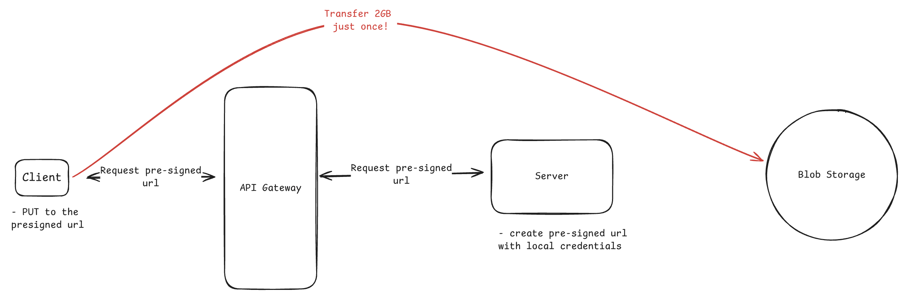
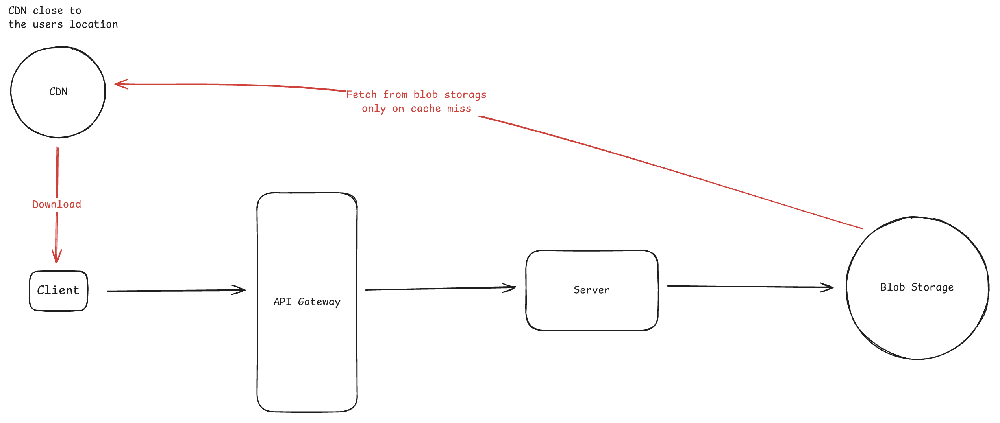
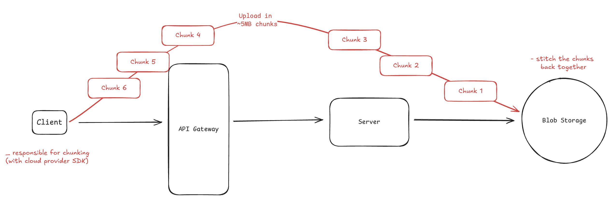
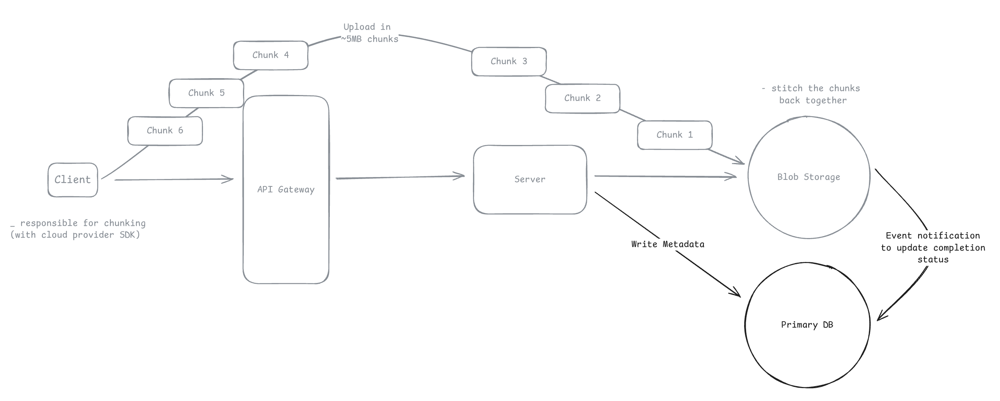
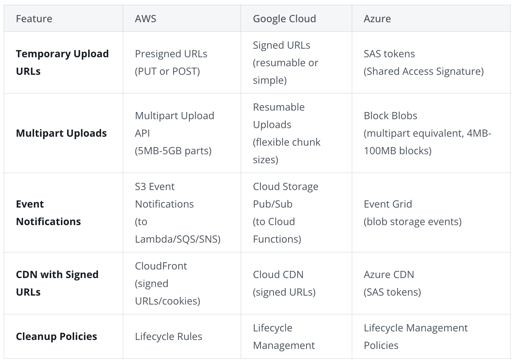

# Handling Large Blob
* Blob storage solves the data storage problem but not the data transfer problem

* Instead of proxying data through server, we pass the data directly from client to the storage
* Server provides client with temporary, scoped credentials to interact directly with storage

## 1. Simple Direct Uploads
* Server receives request for upload permission - validates the user and generate a temporary upload URL **(presigned URL)**
* URL encoled permission to upload one specific file to one specific location for a limited time
* URL generation happens entirely in the application server (no call to he blob storage), using the cloud credentials
* URL includes a cryptographic signature (hash of request details - http method, resource path, expiry, secret key, content-length)
* The client performs a simple HTTP PUT to this URL with the file in the request body. Storage service recalculates the hash and verifies the signature match

## 2. Simple Direct Download
* Happens directly from the storage or CDN
* Generate signed URLs that grant temporary read access to specific files
* CDN distribution costs more but gives better performance for frequently accessed files through geographic distribution and caching
* For CDN delivery - create signed URL, or signer cookie
* Blob storage signatures are validated by storage service using the cloud credentials
* CDN signatures are validated by the CDN edge servers using public/private key cryptography. We hold private key and sign the URL. CDN validates using the public key

## 3. Resumable Uploads for Large Files
* File upload can fail at the end of completion. Need to handle this
* Cloud providers solve this with chunked upload
* AWS S3 uses multipart uploads where each 5MB+ part gets its own presigned URL
* GCS and Azure use single session URLs where you upload chunks with range headers to the same endpoint.
* Client uploads parts, and track completion checksums(hashes of uploaded data) returned by the storage service. 
* If connection drops in between, client queries the storage API to see which parts already uploaded successfully, then resumes
* The storage service maintains this state using the session ID (upload ID in S3, resumable upload URL in GCS)
* Finally, clinet calls completion endpoint with list of all the part number and their checksums. Storage service assembles this into a final object
  

## 4. State Synchronization Challenges
* Challenge: storing file metadata(file_id, upload status, file path etc.) in database while the actual file lives in blob storage.
* The Client can fail to call the app server with complete call after upload for various reasons. 
* Storage service solves this with event notification. 
* When S3 receives a file, it publishes events through messaging services (like SNS/SQS). So, storage service itself confirms and we update the DB
* But event published by storage service can fail as well. Our Server can have a reconcilation system to periodically check for files stuck in pending status and verify them against the storage. 
* So, Events handle the normal fast path, and reconciliation fixes the rare cases that events miss.

## 5. Cloud Provider Terminology

## Deep Dive
### 1. "What if the upload fails at 99%?"
* Use mutipart uplaods for files > 10 MB
  
### 2. "How do you prevent abuse?"
* Implement a post upload processing pipeline where the upload first goes to a quarantine bucket. 
* Run virus scan, content validation, file check for storage bombs, image recognition
* Include file size limits in the presigned URL conditions

### 3. "How do you ensure downloads are fast?"
* Serve everything through CDN with appropriate cache headers
* Ensure range requests work for large files: HTTP's ability to download specific byte ranges of a file. Instead of GET requesting the entire file, the client requests chunks
* Let the CDN and browser handle the optimization.
