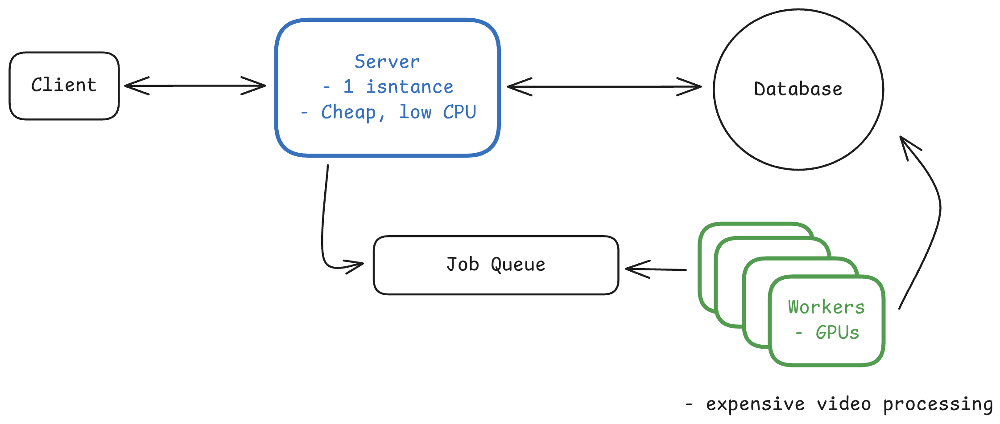
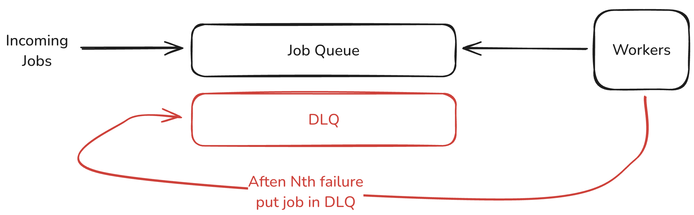
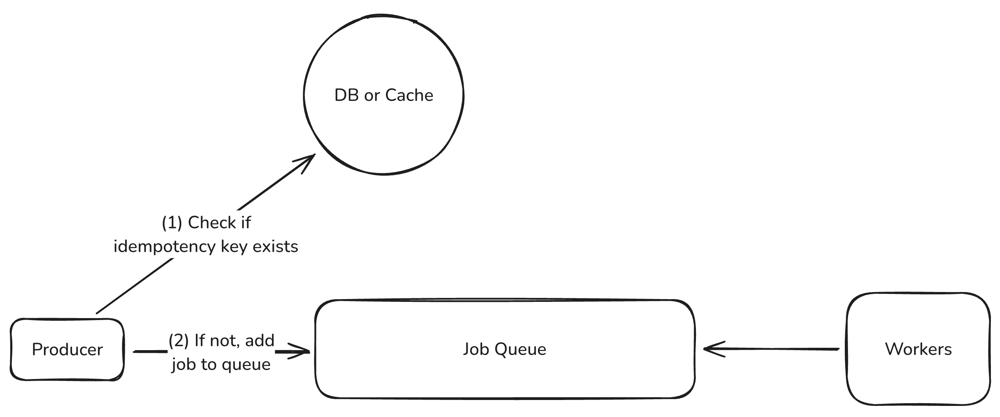
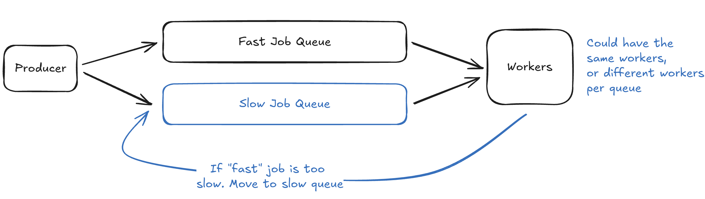
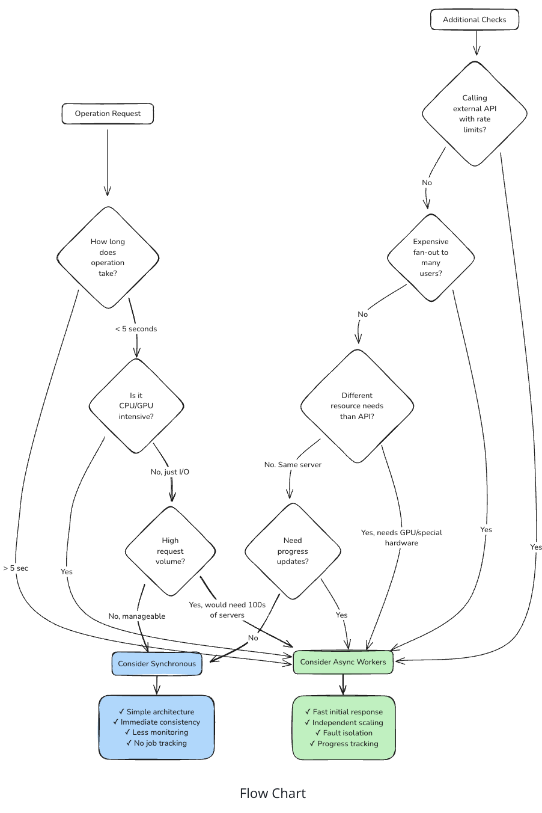

# Long Running Tasks

* If client initiates a request to server which takes long to get processed, client browser shouldn't be waitinng on the loading page itself
* We split the operation in two parts
  * Client sends the request, server store the request in a queue and return a response
  * Actual task happens somewhere else
* Decouple request acceptance from request processing.
* A pool of worker handles the job from queue and update status upon completion
* Uses: Image processing, video transcoding, bulk data imports, third-party API calls with strict rate limits, report generation, email campaigns - they can all benefit from async processing
  

* We need two things:
  * Message Queue
  * Pool of workers

## 1. Message Queue
### 1.1 Redis with Bull/BullMQ
* Redis provides the storage, while Bull adds job queue semantics on top
* Automatic retries, delayed jobs, priority queues
* Redis offers persistence options, it's still memory-first, so you can lose jobs in a hard crash
* Use SQS or RabbitMQ.

### 1.2 AWS SQS
* removes the operational overhead
* Amazon manages the infrastructure, scaling, and guarantees message delivery
* The 1MB message size limit means you're typically still storing job data elsewhere and just passing IDs through the queue

### 1.3 RabbitMQ
* more control with complex routing patterns, but requires self-hosting
* handles sophisticated workflows well
* need to manage clusters, upgrades, monitor disk usage.

### 1.4 Kafka
* Its append-only log lets you replay messages
* fan-out to multiple consumers, and keep data around for long retention windows
* handle huge volumes with strict ordering guarantees (within a partition)

## 2. Workers
### 2.1 "Normal" servers
* Multiple worker servers, pulling jobs from the queue in a loop
* Gives flexibility into debugging as we can look into the servers
* But we need to maintain the servers during quite periods as well

### 2.2 Serverless functions
* Lambda, Cloud Functions
* We need not do server management
* Best solution for spike in workload

### 2.3 Container-based workers
* Kubernetes or ECS
* package workers as Docker containers and let the orchestrator handle scaling and deployment
* more complex than plain servers but more flexibility than serverless

## Dive Deep
### 1. Handling Failures
* If worker fails, job is retried by another worker
* Use heartbeat mechanish to identify if the worker is alive or not

### 2. Handling Repeated Failures
* solution is a Dead Letter Queue (DLQ).
* After a job fails a certain number of times (typically 3-5), move it to a separate queue instead of retrying again
* DLQ becomes a collection of jobs that need human investigation
* Most queue systems have built-in DLQ support

### 3. Preventing Duplicate Work
* solution is idempotency keys
* When accepting a job, require a unique identifier that represents the operation
* Before starting work, check if a job with this key already exists. If it does, return the existing job ID instead of creating a new one.

### 4. Managing Queue Backpressure
* **"It's Black Friday and suddenly you're getting 10x more jobs than usual. Your workers can't keep up. The queue grows to millions of pending jobs. What do you do?"**
* When workers can't process jobs fast enough, queues grow unbounded. Memory usage explodes. Job wait times stretch to hours. New jobs get rejected because the queue is full. Users get frustrated waiting for results that never come.
* backpressure: Slows down job acceptance when workers are overwhelmed. Set queue depth limits and reject new jobs when the queue is too deep and return a "system busy" response
* Autoscale workers based on queue depth. 

### 5. Handling Mixed Workloads
* We can have different tasks - one taking 10 minutes vs one taking 5 hours
* Have separate queue by job type or expected job duration
* Route jobs to the appropriate queue when submitted.
* If you can't predict duration upfront, start jobs in the fast queue and move them to the slow queue if they exceed a time limit

### 6. Orchestrating Job Dependencies
* For complex workflows with branching or parallel steps, use a workflow orchestrator like AWS Step Functions, Temporal, or Airflow.

## Conclusion

