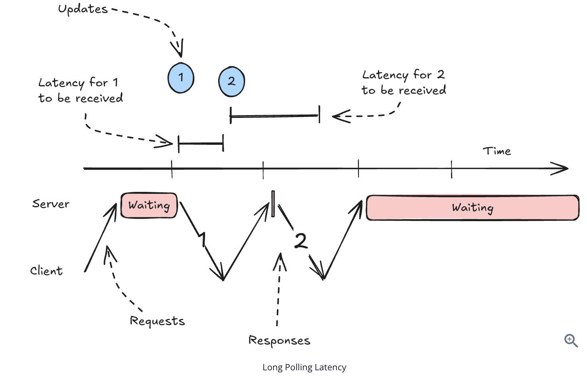
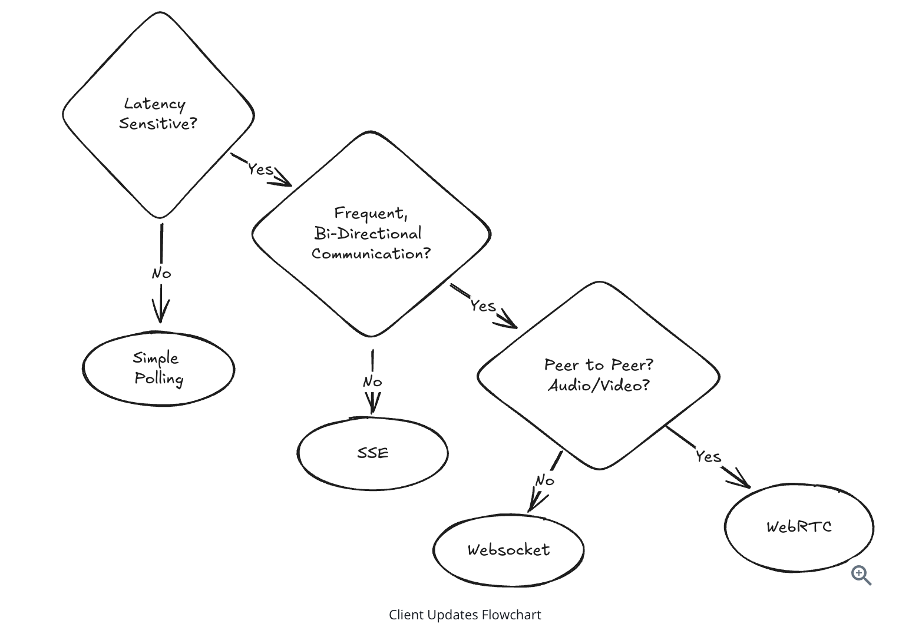
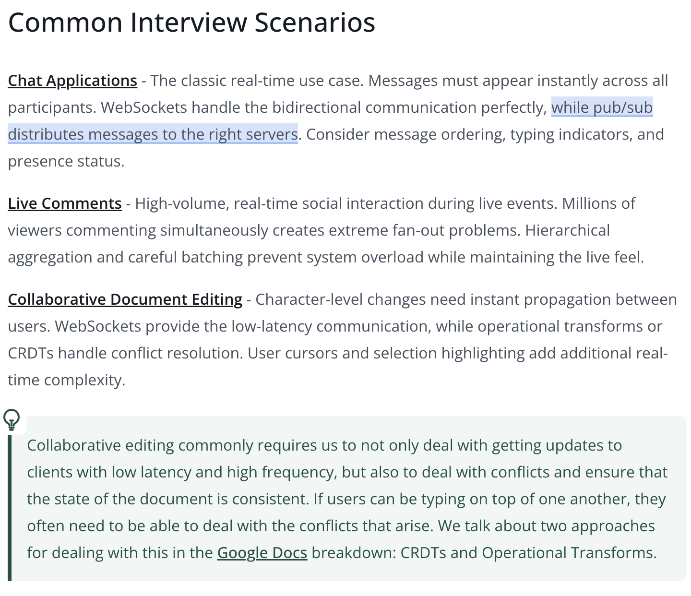
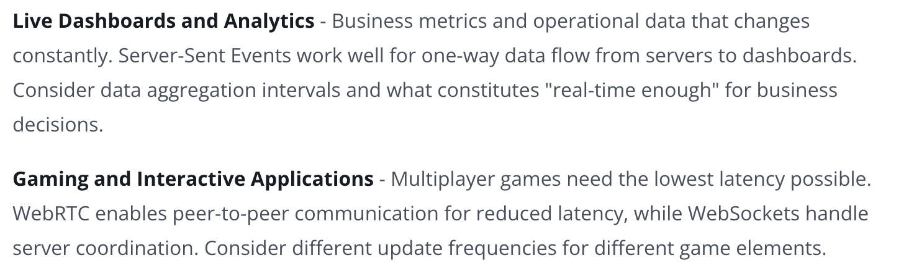

# Real Time Updates

* Problem: Establishing efficient, persistent communication channel between the client and server
* Solution: Two steps:
  * Step1: Getting the update from Server to Client
  * Step2: Getting the update from Source to Server

## Networking Layers
*  Each layer builds on the abstractions of the previous one
*  Layers
   * **Network Layer (L3)**
     * IP handles routing and addressing
     * Break data into packets
     * Handling packet forwarding between networks
     * Provide best-effort delivery to any destination IP address on the network
   * **Transport Layer (L4)**
     * **TCP**
       * Connection oriented protocol
       * Ensures data is delivered correctly and in order
       * Takes time to establish, resource to maintain, bandwidth to use
     * **UDP**
       * Connectionless protocol
       * Send data to any IP address without setup
       * Does not ensure data is delivered correctly or in order
   * **Application Layer (L7)**
     * Application protocols like - DNS, HTTP, Websocket, WebRTC
     * Build on top of TCP to provide a layer of abstraction for different kinds of data
 * Load Balancers:
   * **Layer 4 Load Balancers**
     * Routing decisions based on network information like IP addresses and ports, 
     * Dont have the actual content of the packets.
   * **Layer 7 Load Balancers**
     * examine the actual content of each request and make more intelligent routing decisions.

  

## 1. Client-Server Connection Protocols
### 1.1 Simple Polling: The Baseline
* Client makes a request to the server at a regular interval
* Server responds with the current state of the world
* Advantage: simple to implement, stateless, less infrasturucture needed
* Disadvantage: Higher latency, Limited update frequency, use more bandwidth

### 1.2 Long Polling: The Easy Solution
* Client makes a request to the server and the server holds the request open until new data is available.
* Since the client needs to "call back" to the server after each receipt(response from server), the approach can introduce some extra latency

* Advantage: simple to implement, stateless, less infrasturucture needed
* Disadvantage: High Latency, More HTTP overhead, resource intensive
* When to use: 
  * near real-time updates with a simple implementation.
  * updates are infrequent and a simple solution is preferred
  *  great solution for applications where a long async process is running but you want to know when it finishes, as soon as it finishes - like is often the case in payment processing

### 1.3 Server-Sent Events (SSE)
*  Server sends a stream of data to the client.
*  HTTP responses have header `Content-Length` which tells the client how much data to expect.
*  SSE uses a special header `Transfer-Encoding: chunked` which tells the client that the response is a series of chunks - we don't know how many there are or how big they are until we send them
*  Server sends chunks of data and keeps the request open to send more data
*  Works over HTTP
```
NOTE:
- SSE connections are usually short-lived (30–60s).
- For longer communication, clients need reconnection + gap handling.
- SSE provides a Last-Event-ID mechanism for this.
- Browser EventSource automatically reconnects after disconnection.
- Client sends the last received event ID when reconnecting.
- Server uses this ID to identify missed events.
- Server then sends all events missed during disconnection.
```

### 1.4 Websockets: The Full-Duplex Champion
* bi-directional communication between client and server
* Use for **high frequency** writes and reads
* Websockets build on HTTP through an "upgrade" protocol
* Advantages: Low Latency than HTTP, Efficient for frequent message
* Disadvantages: complex to implement, require special infrastructure, stateful connection
> A very common pattern is to have SSE subscriptions for updates and do writes over simple HTTP POST/PUT whenever they occur.

### 1.5 WebRTC: The Peer-to-Peer Solution
* enables direct peer-to-peer communication between browsers
* perfect for video/audio calls and some data sharing like document editors.
* Clients talk to a central "signaling server" which keeps track of which peers are available together with their connection information
* Once a client has the connection information for another peer, they can try to establish a direct connection without going through any intermediary servers.
* It's overkill for most real-time update use cases
* Advantage: Direct peer communication, Lower latency, Reduced server load, audio/video support
* Disadvantage: Complex setup, Require signalling server



## 2. Server-Side Push/pull
### 2.1 Pulling with Simple Polling
* Simple Polling = pull-based model — client repeatedly asks the server for updates.
* Server stores updates/state, typically in a database
* Client requests only new updates since its last received 
* Example: “Give me messages with timestamps newer than my last message.”
* Polling accepts some delay because updates are retrieved only during the next poll.
* Producer and consumer are decoupled through the database.
* Advantage: Simple architecture and reliable state storage.
* Disadvantage: Not truly real-time; updates can be delayed.

### 2.2 Pushing via Consistent Hashes
* pushing updates to the clients
* client has a persistent connection to one server and that server is responsible for sending updates to the client.

### 2.3 Pushing via Pub/Sub
* We have a single service that is responsible for collecting updates from the source and then broadcasting them to all interested clients.
* Persistent connections are now made to lightweight servers which simply subscribe to the relevant topics and forward the updates to the appropriate clients.
* They decouple update sources from client connections, making your system easier to reason about and scale

## Dive Deep
### 1. "How do you handle connection failures and reconnection?"
* maintain a per-user message queue or implementing sequence numbers that clients can reference during reconnection. Using Redis streams for this is a popular option.

### 2. "What happens when a single user has millions of followers who all need the same update?"
* This is the classic "celebrity problem"
* The solution involves strategic caching and hierarchical distribution
* Instead of writing the update to millions of individual user feeds, cache the update once and distribute through multiple layers
* Regional servers can pull the update and push to their local clients, reducing the load on any single component

### 3. "How do you maintain message ordering across distributed servers?"
* Vector clocks or logical timestamps help establish ordering relationships between messages.
* Each server maintains its own clock, and messages include timestamp information that helps recipients determine the correct order.
* For critical ordering requirements, you might need to funnel all related messages through a single server or partition. 

# NOTE

