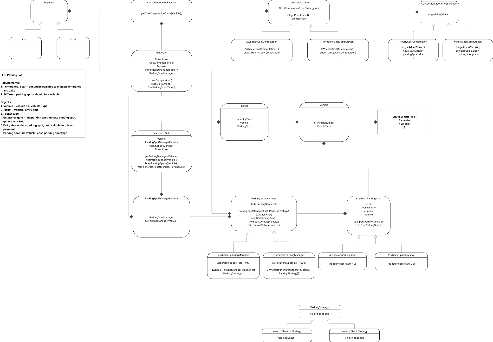

### Open ended questions
- How will you manage the strategy to park vehicle ? - we can use heap to manage the parkinglot which is closer to Lift or Exit, depending on the strategy
- How will you manage the database for the vehicle parked ?
- What about multiple floors in the parking lot ?
- What about multiple entry and exit gates ?
- What can be different payment methods and how will the payment be managed ?

